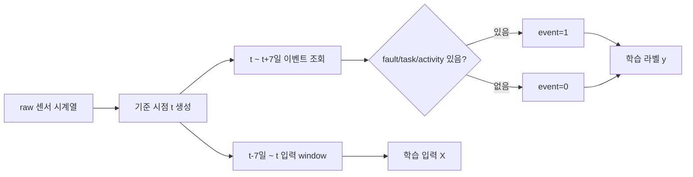

# PreDist 이벤트/고장 라벨 모델링 정리

## 개요

이 문서는 PreDist 데이터셋을 이용해 `raw 센서 데이터 -> 이벤트/고장 예측 -> 정비 우선순위` 모델을 만들 수 있는지 검토한 대화 내용을 정리한 산출물이다.

핵심 결론은 다음과 같다.

- 고장 여부 예측은 `fault` 이벤트 155건을 기준으로 설계할 수 있다.
- 고장 유형 분류는 `Fault label`이 붙은 73건만 직접 사용할 수 있다.
- 정비/수리/점검 예측은 `task + activity` 173건을 정비/운영 개입 이벤트로 묶어 설계할 수 있다.
- 이벤트 발생 예측은 원본 이벤트 328건을 그대로 학습 행으로 쓰는 것이 아니라, raw 센서 시계열을 같은 기준의 시간 window로 잘라 `event=1/0` 라벨을 만들어야 한다.

## 논문이 수행한 작업

논문은 지역난방 기계실 센서 데이터를 보고 고객이 고장 신고를 하기 며칠 전에 이상 징후를 잡을 수 있는지 검증했다.

수행 내용은 다음과 같다.

- 지역난방 기계실 93개에 대한 10분 간격 운영 시계열 데이터를 정리했다.
- 실제 고객 신고/정비 기록을 센서 데이터와 연결했다.
- 정상 상태의 센서 패턴을 Autoencoder 기반 정상행동모델로 학습했다.
- 이후 센서 패턴이 정상과 달라지면 이상으로 판단했다.
- 일부 고장은 고객 신고 3-5일 전에 이상으로 탐지했다.
- ARCANA 기반 feature attribution으로 어떤 센서가 이상 판단에 영향을 줬는지 설명했다.

중요한 점은 논문이 20종 고장명을 직접 다중분류한 것이 아니라는 점이다.

```text
논문 핵심:
raw 센서 시계열 -> 정상 패턴과 다른 이상 징후 탐지 -> 고장 전조 조기탐지

논문 핵심이 아닌 것:
raw 센서 시계열 -> 20종 고장명 직접 분류
```

## 데이터셋 구조

PreDist 데이터셋은 raw 센서 시계열만 있는 데이터가 아니라, 운영 시계열과 여러 메타데이터가 함께 있는 데이터셋이다.

| 파일 | 의미 | 모델링 용도 |
|---|---|---|
| `operational_data/substation_*.csv` | 기계실별 raw 센서 시계열 | 모델 입력 X |
| `disturbances.csv` | fault/task/activity 이벤트 목록 | 이벤트 발생 라벨 |
| `faults.csv` | 고객 신고 기반 고장 리포트와 고장 유형 라벨 | 고장 유형 라벨 |
| `normal_events.csv` | 정상으로 간주할 수 있는 구간 예시 | 정상/음성 검증 구간 |
| `feature_descriptions.csv` | 센서 컬럼 설명 | feature 해석 |

## 전체 이벤트 구조

`disturbances.csv` 기준 전체 이벤트는 328건이다.

| 이벤트 타입 | 개수 | 의미 |
|---|---:|---|
| `fault` | 155 | 고장/고객 신고 이벤트 |
| `task` | 90 | 정비 작업 이벤트 |
| `activity` | 83 | 기타 운영/정비 활동 이벤트, 일부 신고/정비 혼합 가능 |
| 합계 | 328 | 전체 disturbance 이벤트 |

제조사별 이벤트 수는 다음과 같다.

| 제조사 | fault | task | activity | 합계 |
|---|---:|---:|---:|---:|
| manufacturer_1 | 67 | 43 | 55 | 165 |
| manufacturer_2 | 88 | 47 | 28 | 163 |
| 합계 | 155 | 90 | 83 | 328 |

## fault, task, activity의 관계

`fault`, `task`, `activity`는 모두 disturbance event의 하위 타입이다.

```text
disturbance event
├─ fault
├─ task
└─ activity
```

단순화하면 다음처럼 묶을 수 있다.

```text
disturbance
├─ fault
└─ non-fault maintenance
   ├─ task
   └─ activity
```

프로젝트 MVP에서는 다음처럼 이진화할 수 있다.

| 단순 분류 | 원본 type | 의미 | 개수 |
|---|---|---|---:|
| `fault` | `fault` | 고장/신고 | 155 |
| `task` | `task`, `activity` | 정비/작업/운영 개입 | 173 |

주의할 점은 `activity`가 완전히 순수한 정비 작업만 의미하지는 않는다는 점이다. 과거 관리 시스템에서는 incident report와 maintenance task가 하나의 activity 테이블에 같이 기록된 경우가 있어, 일부 신고 성격이 섞였을 수 있다.

## 고장 유형 라벨 구조

`fault` 이벤트는 155건이지만, 그중 고장 원인/종류인 `Fault label`까지 붙은 것은 `faults.csv`의 73건이다.

```text
전체 disturbance 이벤트: 328건
├─ fault 이벤트: 155건
│  ├─ 고장 유형이 분류된 fault: 73건
│  └─ 고장 유형이 분류되지 않은 fault: 82건
└─ task/activity 이벤트: 173건
```

제조사별로 분류되지 않은 fault는 다음과 같다.

| 제조사 | 분류 안 된 fault |
|---|---:|
| manufacturer_1 | 34 |
| manufacturer_2 | 48 |
| 합계 | 82 |

모델링 기준은 다음과 같다.

| 모델 목표 | 사용할 수 있는 데이터 | 이유 |
|---|---:|---|
| 고장 여부 예측 | 155건 | `disturbances.csv`에서 `type=fault`를 알 수 있음 |
| 고장 유형 분류 | 73건 | `faults.csv`에서 `Fault label`이 있음 |
| 정비/운영 개입 예측 | 173건 | `task + activity`를 개입 이벤트로 묶을 수 있음 |
| 전체 이벤트 발생 예측 | 328건 | `fault + task + activity` 전체를 event로 볼 수 있음 |

## 고장 종류별 개수

`faults.csv` 기준 고장 리포트는 73건이고, 고장 종류는 20종이다.

| 한글 고장명 | 원문 라벨 | manufacturer_1 | manufacturer_2 | 합계 |
|---|---|---:|---:|---:|
| 제어장치 파라미터 설정 오류 | Control unit: Incorrect parameterisation | 11 | 2 | 13 |
| 누수 | Leakage | 2 | 8 | 10 |
| 난방 회로 펌프 고장 | Failure of the heating circuit pump | 4 | 4 | 8 |
| 차압 조절기 설정 오류 | Incorrect setting of the differential pressure regulator | 2 | 6 | 8 |
| 미상 | unknown | 2 | 5 | 7 |
| 급탕 저장탱크 충전펌프 고장 | Failure of the domestic hot water storage charging pump | 1 | 5 | 6 |
| 배관 내 공기 혼입 | Air in the piping system | 0 | 3 | 3 |
| 1차측 전동 제어밸브 액추에이터 고장 | Motorised control valve (primary side): Actuator defective | 2 | 1 | 3 |
| 차압 조절기 고장 | Differential pressure regulator defective | 2 | 0 | 2 |
| 안전밸브 폐쇄 불량에 따른 물 손실 | Safety relief valve: Water loss, does not close properly | 2 | 0 | 2 |
| 차단밸브 닫힘 | Shut-off valve closed | 1 | 1 | 2 |
| 차압 조절기 닫힘 고착 | Differential pressure regulator jams when closed | 0 | 1 | 1 |
| 열량계 고장 | Failure of the thermal energy meter | 0 | 1 | 1 |
| 열교환기 외부 누수 | Heat exchanger: Leakage, external | 1 | 0 | 1 |
| 팽창탱크 예압 부족 | Low pre-charge at the expansion vessel | 0 | 1 | 1 |
| 1차측 전동 제어밸브 고장 | Motorised control valve (primary side) defective | 1 | 0 | 1 |
| 1차측 전동 제어밸브 닫힘 고착 | Motorised control valve (primary side): Control valve jams when closed | 1 | 0 | 1 |
| 1차측 전동 제어밸브 액추에이터 동작시간 설정 오류 | Motorised control valve (primary side): Incorrect setting of the actuator travel time | 0 | 1 | 1 |
| 2차측 스트레이너 유량 저하 | Strainer (secondary side): Poor flow rate | 0 | 1 | 1 |
| 온도 감시/제어기 고장 | Temperature monitor/controller defective | 1 | 0 | 1 |

## 고객 신고 문제 유형

`faults.csv`의 `Problem EN` 기준 고객 신고 문제 유형은 9종이다.

| 고객 신고 문제 | 개수 |
|---|---:|
| no heat | 27 |
| leakage | 12 |
| not enough heat | 11 |
| no DHW | 10 |
| noise | 4 |
| other | 4 |
| Noise | 3 |
| Meter | 1 |
| Pressure fluctuations | 1 |

대소문자만 다른 `noise`와 `Noise`를 합치면 소음 관련 신고는 7건이다.

## 조기탐지 가능성과 monitoring potential

고장 유형별 `efd_possible`과 monitoring potential은 다음과 같이 해석할 수 있다.

| 고장 유형 | 총건수 | efd_possible | monitoring potential 평균 | 해석 |
|---|---:|---:|---:|---|
| 제어장치 파라미터 설정 오류 | 13 | 9 | 4.00 | 센서 기반 조기탐지 가능성이 높은 편 |
| 누수 | 10 | 7 | 1.75 | 빈도는 높지만 센서만으로는 약할 수 있음 |
| 난방 회로 펌프 고장 | 8 | 6 | 3.80 | 조기탐지 후보로 적합 |
| 차압 조절기 설정 오류 | 8 | 6 | 3.10 | 조기탐지 후보로 가능 |
| 미상 | 7 | 6 | 없음 | 라벨 정의가 불명확함 |
| 급탕 저장탱크 충전펌프 고장 | 6 | 4 | 3.70 | 조기탐지 후보로 가능 |

전체적으로 `efd_possible=True`인 고장 리포트는 55건이다.

## 기간과 연도별 이벤트 수

전체 328건은 약 7.31년 동안 발생했다.

| 항목 | 값 |
|---|---|
| 전체 이벤트 수 | 328 |
| 시작일 | 2013-02-19 |
| 종료일 | 2020-06-13 |
| 기간 | 약 7.31년 |

제조사별 기간은 다음과 같다.

| 제조사 | 이벤트 수 | 시작일 | 종료일 |
|---|---:|---|---|
| manufacturer_1 | 165 | 2013-02-19 | 2020-06-13 |
| manufacturer_2 | 163 | 2015-10-19 | 2020-03-25 |

이벤트 타입별 기간은 다음과 같다.

| 타입 | 건수 | 시작일 | 종료일 |
|---|---:|---|---|
| activity | 83 | 2013-02-19 | 2017-06-07 |
| fault | 155 | 2014-05-02 | 2020-06-13 |
| task | 90 | 2017-07-31 | 2020-06-07 |

연도별 이벤트 수는 다음과 같다.

| 연도 | activity | fault | task | 합계 |
|---:|---:|---:|---:|---:|
| 2013 | 2 | 0 | 0 | 2 |
| 2014 | 8 | 4 | 0 | 12 |
| 2015 | 24 | 11 | 0 | 35 |
| 2016 | 24 | 22 | 0 | 46 |
| 2017 | 25 | 12 | 3 | 40 |
| 2018 | 0 | 12 | 12 | 24 |
| 2019 | 0 | 56 | 49 | 105 |
| 2020 | 0 | 38 | 26 | 64 |

## 날짜 중복 여부

328건이 모두 서로 다른 날짜에 하나씩 있는 것은 아니다.

| 기준 | 값 |
|---|---:|
| 전체 이벤트 수 | 328 |
| 이벤트가 발생한 고유 날짜 수 | 228 |
| 2건 이상 이벤트가 발생한 날짜 수 | 63 |
| 하루 최대 이벤트 수 | 8 |
| 고유 manufacturer+substation+date 수 | 274 |
| 같은 기계실 같은 날짜에 2건 이상 이벤트가 있는 경우 | 46 |
| 같은 기계실 같은 날짜의 최대 이벤트 수 | 5 |
| 완전히 동일한 `manufacturer + substation ID + Event start + type` 중복 | 0 |

이벤트가 많이 겹친 날짜는 다음과 같다.

| 날짜 | 이벤트 수 |
|---|---:|
| 2019-11-29 | 8 |
| 2017-03-14 | 5 |
| 2019-11-15 | 5 |
| 2019-11-28 | 5 |
| 2020-01-21 | 4 |
| 2020-02-04 | 4 |

같은 기계실 같은 날짜에 여러 이벤트가 있던 대표 사례는 다음과 같다.

| 제조사 | 기계실 | 날짜 | 이벤트 수 |
|---|---:|---|---:|
| manufacturer_2 | 50 | 2019-11-28 | 5 |
| manufacturer_2 | 43 | 2019-11-29 | 3 |
| manufacturer_2 | 50 | 2019-11-19 | 3 |
| manufacturer_1 | 17 | 2019-01-12 | 3 |
| manufacturer_1 | 28 | 2019-10-07 | 3 |

## raw 센서로 20종 고장 정의가 가능한가

raw 센서 데이터에 고장 라벨을 붙여 학습 데이터셋을 만드는 것은 가능하다. 하지만 raw 센서만으로 20종 고장을 모두 안정적으로 정의하고 분류하는 것은 어렵다.

가능한 것:

- 센서 구간에 `faults.csv`의 고장 라벨을 연결할 수 있다.
- `Training start/end`, `Possible anomaly start/end`, `Report date`를 이용해 고장 전 구간을 만들 수 있다.
- `efd_possible=True`인 55건은 조기탐지 실험에 사용할 수 있다.

어려운 것:

- `Fault label`은 센서에서 자동 생성된 라벨이 아니라 고객 신고/정비 리포트 기반 라벨이다.
- 총 라벨 데이터가 73건뿐인데 고장 종류는 20종이다.
- 1건짜리 희소 라벨이 많다.
- `unknown` 라벨이 7건 있다.
- 기계실/제조사마다 센서 컬럼이 다르다.

따라서 20종 직접 분류보다 다음 구조가 현실적이다.

```text
raw 센서 -> 고장 위험 예측 -> 고장군 추정 -> 빈도 기반 우선순위
```

## 빈도 기반 우선순위

피해량 라벨은 데이터셋에 없다. 따라서 고객 피해량을 직접 학습하는 것은 어렵다.

대신 빈번도를 기준으로 우선순위를 만들 수 있다.

```text
priority_score = predicted_fault_probability * historical_fault_frequency_weight
```

예시:

| 예측 고장 | 예측 확률 | 과거 빈도 | 빈도 가중치 | 우선순위 점수 |
|---|---:|---:|---:|---:|
| 누수 | 0.60 | 10 | 10/13 = 0.77 | 0.46 |
| 제어장치 설정 오류 | 0.40 | 13 | 13/13 = 1.00 | 0.40 |
| 펌프 고장 | 0.50 | 8 | 8/13 = 0.62 | 0.31 |

이 예시에서는 누수가 가장 높은 우선순위가 된다.

## 이벤트 발생 예측의 이진분류 정의

이벤트 발생 예측은 다음 이진분류로 정의하는 것이 적합하다.

```text
event = 1
향후 N시간/일 안에 fault, task, activity 중 하나라도 발생

event = 0
향후 N시간/일 안에 fault, task, activity가 하나도 없음
```

즉:

```text
이벤트 발생 = fault OR task OR activity
이벤트 없음 = no disturbance
```

중요한 점은 `disturbances.csv`의 328건이 바로 학습 행이 아니라는 점이다. 학습하려면 raw 센서 시계열에서 같은 기준의 window를 만들어야 한다.

## 같은 기준으로 window 자르기

학습 샘플은 다음과 같이 정의한다.

```text
기준 시점 t

X = t 이전 7일 센서 데이터
y = 1 if t 이후 7일 안에 fault/task/activity 발생
y = 0 if t 이후 7일 안에 fault/task/activity 없음
```

권장 MVP 기준:

| 항목 | 값 |
|---|---|
| 입력 구간 | 최근 7일 |
| 예측 구간 | 다음 7일 |
| 샘플 간격 | 1일 |
| positive 라벨 | 다음 7일 안에 disturbance 이벤트 있음 |
| negative 라벨 | 다음 7일 안에 disturbance 이벤트 없음 |

Mermaid 흐름은 다음과 같다.



## 7일 입력/7일 예측 기준 실제 window 개수

실제 raw 센서 zip과 `disturbances.csv`를 이용해 다음 기준으로 window를 생성했다.

```text
입력: 최근 7일 raw 센서 데이터
예측: 다음 7일 안에 fault/task/activity 발생 여부
stride: 1일
```

결과는 다음과 같다.

| 구분 | 개수 |
|---|---:|
| 전체 window 샘플 | 82,054 |
| event=1 | 1,393 |
| event=0 | 80,661 |

제조사별 결과는 다음과 같다.

| 제조사 | 전체 window | event=1 | event=0 |
|---|---:|---:|---:|
| manufacturer_1 | 48,093 | 814 | 47,279 |
| manufacturer_2 | 33,961 | 579 | 33,382 |
| 합계 | 82,054 | 1,393 | 80,661 |

positive window 안에 포함된 이벤트 타입은 다음과 같이 겹칠 수 있다.

| 포함 이벤트 타입 | positive window 수 |
|---|---:|
| fault 포함 | 830 |
| task 포함 | 510 |
| activity 포함 | 468 |

한 window 안에 여러 이벤트 타입이 함께 들어갈 수 있으므로 위 합계는 1,393보다 클 수 있다.

## 328건이 1,393개가 되는 이유

328건은 원본 이벤트 개수이고, 1,393개는 `event=1` 학습 window 개수다.

하나의 이벤트가 여러 개의 positive window를 만들 수 있다.

예를 들어 3월 10일에 이벤트가 있고 예측 horizon이 7일이면 다음 기준 시점들은 모두 `event=1`이다.

```text
3월 3일 기준 -> 다음 7일 안에 3월 10일 이벤트 있음 -> event=1
3월 4일 기준 -> 다음 7일 안에 3월 10일 이벤트 있음 -> event=1
3월 5일 기준 -> 다음 7일 안에 3월 10일 이벤트 있음 -> event=1
3월 6일 기준 -> 다음 7일 안에 3월 10일 이벤트 있음 -> event=1
3월 7일 기준 -> 다음 7일 안에 3월 10일 이벤트 있음 -> event=1
3월 8일 기준 -> 다음 7일 안에 3월 10일 이벤트 있음 -> event=1
3월 9일 기준 -> 다음 7일 안에 3월 10일 이벤트 있음 -> event=1
```

즉 이벤트 1건이 최대 7개의 positive window를 만들 수 있다.

하지만 단순히 `328 * 7 = 2,296`이 되지는 않는다.

이유:

- 이벤트들이 서로 가까이 붙어 있으면 같은 window에 여러 이벤트가 들어간다.
- 같은 window에 이벤트가 2개 이상 있어도 라벨은 `event=1` 하나다.
- 센서 데이터 시작/끝 경계에 걸린 이벤트는 7개 window를 모두 만들지 못한다.
- 어떤 기계실은 해당 시점 전 7일 입력 데이터가 부족할 수 있다.

따라서 실제 계산 결과는 다음과 같다.

```text
원본 이벤트: 328건
event=1 학습 window: 1,393개
```

쉽게 말하면:

```text
328 = 실제 사건 수
1,393 = 그 사건들을 7일 전에 맞힐 수 있는 예측 기회 수
```

## 학습 시 주의점

7일 입력/7일 예측 기준으로 전체 window를 만들면 클래스 불균형이 매우 크다.

```text
event=1: 1,393
event=0: 80,661
```

따라서 학습에는 다음 방식이 필요하다.

- event=1은 전부 사용한다.
- event=0은 일부만 샘플링한다.
- 예: event=1 1,393개 + event=0 1,393개 또는 2,786개.
- train/test를 랜덤으로 섞지 않는다.
- 겹치는 window가 많기 때문에 시간 기준 split 또는 기계실 기준 split을 사용한다.

## 추천 모델 목표

이 데이터셋으로 가장 현실적인 MVP는 다음 순서다.

```text
1단계: 전체 이벤트 발생 예측
최근 7일 센서 -> 다음 7일 안에 fault/task/activity 발생 여부

2단계: 이벤트 타입 분류
발생한다면 fault인가, task/activity인가

3단계: 고장군 추정
fault라면 20종 직접 분류보다 고장군으로 묶어 분류

4단계: 우선순위 산정
예측 확률 * 과거 빈도 가중치
```

고장군 예시는 다음과 같다.

| 고장군 | 포함 예시 |
|---|---|
| 제어/설정 오류 | 제어장치 파라미터 설정 오류, 차압 조절기 설정 오류 |
| 누수/압력계 | 누수, 안전밸브 물 손실, 팽창탱크 예압 부족 |
| 펌프/순환계 | 난방 펌프, 급탕 충전펌프, 스트레이너 유량 저하 |
| 밸브/조절기계 | 전동 제어밸브, 차단밸브, 조절기 고착 |
| 계측/센서계 | 열량계, 온도 감시/제어기 |
| 미상 | unknown |

## 결론

PreDist 데이터셋만으로 고객 피해량을 직접 예측하는 것은 어렵다. 피해 금액, 민원 강도, 복구 시간, 서비스 중단 시간, 긴급 출동 여부 같은 라벨이 없기 때문이다.

하지만 다음 모델은 구현 가능하다.

```text
raw 센서 시계열
-> 향후 7일 내 disturbance 이벤트 발생 예측
-> fault 또는 task/activity 구분
-> 고장군/빈도 기반 우선순위 산정
```

따라서 현재 데이터셋에서 가장 타당한 방향은 다음이다.

```text
센서 기반 이벤트 발생 위험도 + 과거 이벤트/고장 빈도 = 점검 우선순위
```
