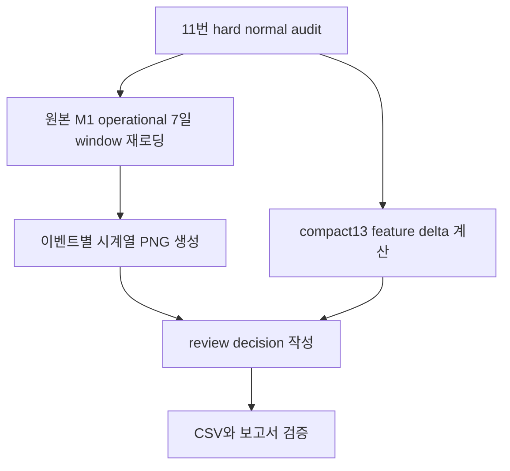

# M1 Hard Normal 시계열 육안 검토 보고서

## 개요

이번 단계는 학습이 아니라 `compact13 + threshold 0.6` 기준에서 hard normal로 잡힌 normal 8건의 7일 원시 시계열을 사람이 검토할 수 있게 정리한 것이다. 회사 제공 normal 라벨은 변경하지 않았다.

최종 결론: **일부 event는 review_required_normal로 후속 수동 검토**

## 무엇을 했는지

- Event 35, 48을 우선 검토하고, 나머지 hard normal Event 8, 19, 27, 33, 39, 68도 같은 방식으로 확인했다.
- 원본 operational CSV에서 7일 window를 다시 읽어 이벤트별 시계열 PNG를 만들었다.
- threshold 0.6에서 FP 근거가 된 compact13 feature 편차를 true negative normal 및 positive 평균과 비교했다.
- `keep_normal`, `hard_normal_metadata`, `review_required_normal` 중 하나로 audit tag를 부여했다.

## 이벤트별 판단

| source_event_id | substation_id | window_start | window_end | review_label | coverage_rate | disturbance_count | max_compact_probability | positive_like_feature_count | max_abs_z_vs_true_negative | review_reason |
| --- | --- | --- | --- | --- | --- | --- | --- | --- | --- | --- |
| 8 | 6 | 2020-06-02 00:00 | 2020-06-09 00:00 | hard_normal_metadata | 1.000 | 0 | 0.955 | 4 | 1.79 | compact13 변화량이 true negative normal 평균에서 벗어나 모델 해석용 태그 유지 |
| 19 | 8 | 2018-02-01 00:00 | 2018-02-08 00:00 | review_required_normal | 1.000 | 0 | 0.877 | 5 | 1.72 | compact13 feature 다수가 positive 평균에 더 가까워 후속 수동 검토 필요 |
| 27 | 12 | 2015-06-24 13:34 | 2015-07-01 13:34 | hard_normal_metadata | 1.000 | 0 | 0.604 | 3 | 2.62 | compact13 변화량이 true negative normal 평균에서 벗어나 모델 해석용 태그 유지 |
| 33 | 3 | 2019-01-11 00:00 | 2019-01-18 00:00 | hard_normal_metadata | 1.000 | 0 | 0.635 | 2 | 2.16 | compact13 변화량이 true negative normal 평균에서 벗어나 모델 해석용 태그 유지 |
| 35 | 11 | 2017-10-31 00:00 | 2017-11-07 00:00 | hard_normal_metadata | 1.000 | 0 | 0.997 | 4 | 3.59 | 같은 substation에서 hard normal이 반복되어 설비 고유 정상 패턴 후보 |
| 39 | 15 | 2018-09-30 00:00 | 2018-10-07 00:00 | hard_normal_metadata | 1.000 | 0 | 0.875 | 2 | 3.47 | compact13 변화량이 true negative normal 평균에서 벗어나 모델 해석용 태그 유지 |
| 48 | 11 | 2016-09-30 00:00 | 2016-10-07 00:00 | hard_normal_metadata | 1.000 | 0 | 0.775 | 4 | 2.04 | 같은 substation에서 hard normal이 반복되어 설비 고유 정상 패턴 후보 |
| 68 | 13 | 2019-12-20 00:00 | 2019-12-27 00:00 | review_required_normal | 1.000 | 0 | 0.688 | 7 | 2.21 | compact13 feature 다수가 positive 평균에 더 가까워 후속 수동 검토 필요 |

## 주요 판단 근거

| source_event_id | top_deviation_features_short | compact13_closer_summary |
| --- | --- | --- |
| 8 | supply error last-first|supply setpoint last 1d mean-prev 6d mean|outdoor last 12h mean-prev 12h mean | true_negative_like |
| 19 | outdoor last-first|outdoor last 12h mean-prev 12h mean|return gap last-first | true_negative_like |
| 27 | outdoor last 6h mean-prev 6h mean|outdoor last 12h mean-prev 12h mean|return gap last-first | true_negative_like |
| 33 | outdoor last 6h mean-prev 6h mean|flow last 1d std-prev 6d std|outdoor last 12h mean-prev 12h mean | true_negative_like |
| 35 | supply setpoint last 1d mean-prev 6d mean|supply error last-first|return gap last 1d mean-prev 6d mean | true_negative_like |
| 39 | supply setpoint last 1d mean-prev 6d mean|supply error last-first|outdoor last-first | true_negative_like |
| 48 | net return last 1d mean-prev 6d mean|hc1 return last 1d mean-prev 6d mean|return gap last-first | true_negative_like |
| 68 | hc1 return last 1d mean-prev 6d mean|flow last 1d std-prev 6d std|outdoor last 12h mean-prev 12h mean | positive_like |

## Substation 11 Event 35/48

Event 35와 48은 모두 `substation_id=11`에서 발생한 hard normal이다. 두 이벤트 모두 disturbance count가 0이고 coverage가 충분하므로 normal 라벨을 유지한다. 다만 같은 substation에서 반복적으로 threshold 0.6 이상 위험 확률이 나온 만큼, 이 substation의 정상 운전 패턴이 compact13 feature에서 positive와 일부 비슷하게 보일 수 있다. 따라서 현재 결론은 삭제나 재라벨링이 아니라 `hard_normal_metadata`로 관리하는 것이다.

## 생성 이미지

| 항목 | 파일 |
| --- | --- |
| Event 35 | m1_hard_normal_event_0035_timeseries.png |
| Event 48 | m1_hard_normal_event_0048_timeseries.png |
| Event 8 | m1_hard_normal_event_0008_timeseries.png |
| Event 19 | m1_hard_normal_event_0019_timeseries.png |
| Event 27 | m1_hard_normal_event_0027_timeseries.png |
| Event 33 | m1_hard_normal_event_0033_timeseries.png |
| Event 39 | m1_hard_normal_event_0039_timeseries.png |
| Event 68 | m1_hard_normal_event_0068_timeseries.png |
| Event 35/48 비교 | m1_hard_normal_substation11_event35_48_comparison.png |
| compact13 그룹 비교 | m1_hard_normal_compact13_group_comparison.png |

## 변경 내용

| 항목 | 내용 |
| --- | --- |
| 노트북 | `06_노트북/12_m1_hard_normal_timeseries_review.ipynb` |
| 검토 CSV | `07_데이터산출물/m1_hard_normal_timeseries_review.csv` |
| feature delta CSV | `07_데이터산출물/m1_hard_normal_event_feature_deltas.csv` |
| decision CSV | `07_데이터산출물/m1_hard_normal_review_decision.csv` |
| 보고서 | `07_데이터산출물/12_M1_hard_normal_timeseries_review_보고서.md` |

## 검증

- hard normal 8건이 모두 review CSV에 포함됐다.
- Event 35/48 별도 비교 PNG를 생성했다.
- normal 라벨 값은 변경하지 않았다.
- 8개 이벤트의 disturbance count는 모두 0으로 재확인됐다.
- Event 20, 34, 69는 판단 dataset에 포함되지 않았다.
- 비대상 제조사 문자열이 산출물에 들어가지 않았는지 검사했다.

## 한계와 주의점

- 이번 판단은 모델 재학습이나 threshold 변경이 아니다.
- `hard_normal_metadata`는 정상 라벨을 유지하면서 해석용으로 남기는 tag다.
- 시계열 육안 검토만으로 설비 원인을 확정하지 않는다. 특히 substation 11은 정상 패턴 보정 후보로 다음 실험에서 별도 feature 또는 substation-aware 해석을 검토할 필요가 있다.

## 다음에 볼 것

- substation 11 정상 window를 더 확보할 수 있는지 확인한다.
- hard normal과 positive를 가르는 feature가 최근 6시간/12시간 변화에 과도하게 의존하는지 점검한다.
- normal 라벨은 유지한 채, hard normal metadata를 학습 평가 리포트에 계속 표시한다.
