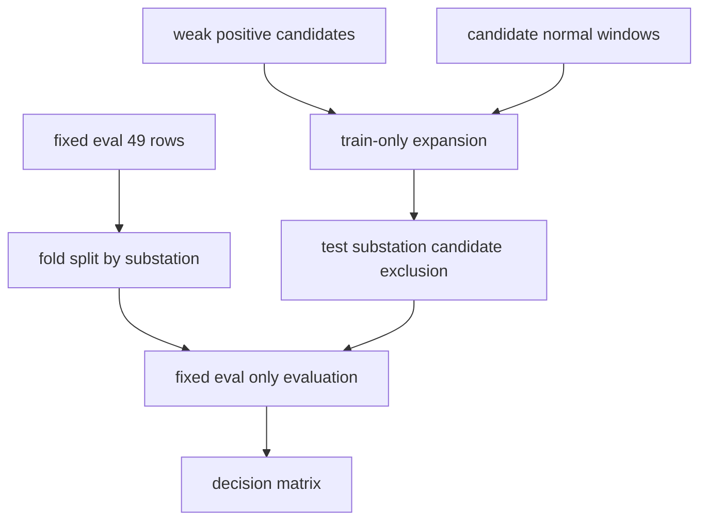

# M1 Expanded Training Fixed-Eval 검증 보고서

## 개요

이번 단계는 feature/model/threshold를 바꾸지 않고 학습 데이터만 확장했을 때, 기존 `strict_no_event20` 49행 fixed eval 성능이 유지되는지 검증했다.

최종 결론: **expanded_compact13를 다음 기준 후보로 채택**

## 무엇을 했는지

- fixed eval 49행은 그대로 평가에만 사용했다.
- weak positive 후보는 coverage 0.95 이상만 학습 후보로 추가했다.
- candidate normal은 disturbance/fault/fixed eval window와 겹치지 않는 7일 window만 선택했다.
- 각 fold에서 test substation과 같은 expansion candidate는 train에서 제외했다.
- Event 19/68은 삭제하지 않고 `review_required_normal` tag로만 유지했다.

## 데이터 구성

| pool_role | candidate_type | label | y | rows |
| --- | --- | --- | --- | --- |
| expansion_candidate | candidate_normal | candidate_normal | 0 | 70 |
| expansion_candidate | weak_positive | efd_possible | 1 | 12 |
| fixed_eval | fixed_eval | efd_possible | 1 | 14 |
| fixed_eval | fixed_eval | normal | 0 | 35 |

## 평가 결과

| evaluation_scope | strategy | n | balanced_accuracy | precision | recall | f1 | false_positive_count | false_negative_count | false_positive_rate | hard_normal_35_48_fp_count |
| --- | --- | --- | --- | --- | --- | --- | --- | --- | --- | --- |
| main_all_49 | dummy_most_frequent | 49 | 0.5000 | 0.0000 | 0.0000 | 0.0000 | 0 | 14 | 0.0000 | 0 |
| main_all_49 | expanded_compact13 | 49 | 0.8500 | 0.7857 | 0.7857 | 0.7857 | 3 | 3 | 0.0857 | 0 |
| main_all_49 | reference_compact13 | 49 | 0.8286 | 0.8333 | 0.7143 | 0.7692 | 2 | 4 | 0.0571 | 0 |
| sensitivity_exclude_review_required_19_68 | dummy_most_frequent | 47 | 0.5000 | 0.0000 | 0.0000 | 0.0000 | 0 | 14 | 0.0000 | 0 |
| sensitivity_exclude_review_required_19_68 | expanded_compact13 | 47 | 0.8626 | 0.8462 | 0.7857 | 0.8148 | 2 | 3 | 0.0606 | 0 |
| sensitivity_exclude_review_required_19_68 | reference_compact13 | 47 | 0.8420 | 0.9091 | 0.7143 | 0.8000 | 1 | 4 | 0.0303 | 0 |

## Decision Matrix

| criterion | reference_value | expanded_value | delta | pass | final_decision |
| --- | --- | --- | --- | --- | --- |
| balanced_accuracy_not_drop_over_0_02 | 0.8286 | 0.8500 | 0.0214 | True | expanded_compact13_candidate |
| recall_not_drop_over_0_05 | 0.7143 | 0.7857 | 0.0714 | True | expanded_compact13_candidate |
| fpr_not_worse_over_0_05 | 0.0571 | 0.0857 | 0.0286 | True | expanded_compact13_candidate |
| sensitivity_stable_without_19_68 | 0.8420 | 0.8626 | 0.0206 | True | expanded_compact13_candidate |
| hard_normal_35_48_not_worse | 0.0000 | 0.0000 | 0.0000 | True | expanded_compact13_candidate |

## 변경 내용

| 항목 | 내용 |
| --- | --- |
| 노트북 | `06_노트북/13_m1_expanded_training_fixed_eval_validation.ipynb` |
| 후보 audit | `07_데이터산출물/m1_expansion_candidate_audit.csv` |
| feature pool | `07_데이터산출물/m1_expansion_feature_pool.csv` |
| 예측/성능 | `m1_expanded_training_fixed_eval_predictions.csv`, `m1_expanded_training_fixed_eval_cv_metrics.csv` |
| 판단 | `m1_expanded_training_fixed_eval_decision_matrix.csv` |

## 검증

- fixed eval은 49행, normal 35행, positive 14행으로 유지됐다.
- 제외 event는 학습/평가 feature pool에 들어가지 않았다.
- Event 19/68은 평가에서 삭제하지 않고 review tag로만 남겼다.
- accepted weak positive coverage는 모두 0.95 이상이다.
- accepted candidate normal은 disturbance/fault/fixed eval window와 겹치지 않는다.
- 모든 fold에서 train/test substation overlap은 0이다.
- 학습 feature는 compact13 13개만 사용했다.

## 한계와 주의점

- expansion candidate는 회사 제공 normal label이 아니라 학습 후보 normal이므로 `candidate_normal`로 분리했다.
- 이번 결과는 모델 저장이나 운영 배포가 아니다.
- fixed eval은 작기 때문에 성능 숫자 하나보다 FP/FN 패턴과 hard normal 악화 여부를 같이 봐야 한다.

## 다음에 볼 것

- expanded 기준이 채택되면, 다음 단계는 candidate normal/weak positive의 수를 늘리는 방향이다.
- 채택되지 않으면, 후보 window 생성 기준과 weak positive 품질 기준을 다시 조정해야 한다.
