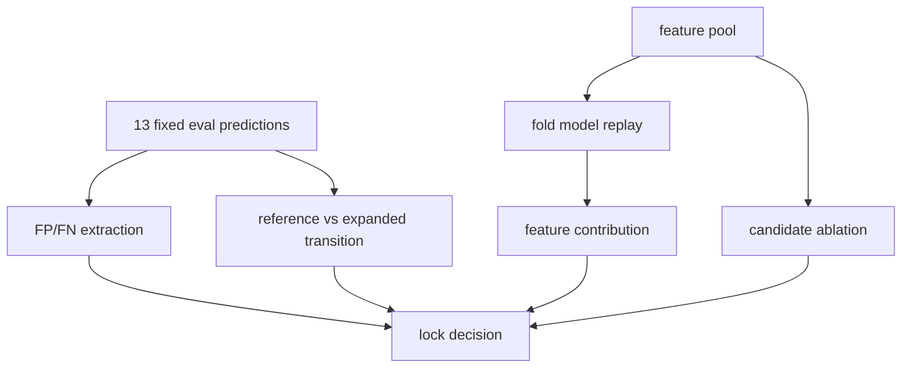

# M1 Expanded Compact13 오분류 Audit 보고서

## 개요

이번 단계는 `expanded_compact13 + threshold 0.6` 기준에서 남은 FP/FN 6건을 해석하고, expanded dataset을 다음 학습 기준으로 잠글 수 있는지 판단한 것이다.

최종 결론: **expanded_compact13_dataset_lock**

## 무엇을 했는지

- fixed eval 49행은 유지했다.
- FP Event 27, 28, 68과 FN Event 15, 40, 52를 event 단위로 audit했다.
- reference 대비 expanded 예측 변화가 새 오류인지, 기존 오류인지, 교정 오류인지 분류했다.
- weak positive와 candidate normal의 기여를 분리하기 위해 candidate ablation 4조건을 비교했다.
- compact13 coefficient contribution으로 각 오분류의 주요 drive feature를 정리했다.

## 오분류 6건

| error_type | source_event_id | substation_id | label | review_tag | y_probability | reference_probability | probability_delta_vs_reference | transition_type | coverage_rate | disturbance_count | fault_window_overlap_count | new_hard_normal_candidate | label_quality_issue |
| --- | --- | --- | --- | --- | --- | --- | --- | --- | --- | --- | --- | --- | --- |
| FN | 15 | 29 | efd_possible | nan | 0.2185 | 0.0277 | 0.1908 | unchanged_error | 1.0000 | 0 | 1 | False | False |
| FN | 40 | 24 | efd_possible | nan | 0.3021 | 0.0536 | 0.2485 | unchanged_error | 0.9950 | 3 | 1 | False | False |
| FN | 52 | 21 | efd_possible | nan | 0.5643 | 0.1208 | 0.4435 | unchanged_error | 1.0000 | 1 | 2 | False | False |
| FP | 27 | 12 | normal | hard_normal_metadata | 0.9824 | 0.6713 | 0.3111 | unchanged_error | 1.0000 | 0 | 0 | False | False |
| FP | 28 | 7 | normal | nan | 0.9650 | 0.5095 | 0.4555 | new_error | 1.0000 | 0 | 0 | True | False |
| FP | 68 | 13 | normal | review_required_normal | 0.6269 | 0.7193 | -0.0923 | unchanged_error | 1.0000 | 0 | 0 | False | False |

## Candidate Ablation

| strategy | n | balanced_accuracy | precision | recall | f1 | false_positive_count | false_negative_count | false_positive_rate | hard_normal_35_48_fp_count | review_required_19_68_fp_count |
| --- | --- | --- | --- | --- | --- | --- | --- | --- | --- | --- |
| expanded_both | 49 | 0.8500 | 0.7857 | 0.7857 | 0.7857 | 3 | 3 | 0.0857 | 0 | 1 |
| normal_only | 49 | 0.8500 | 0.7857 | 0.7857 | 0.7857 | 3 | 3 | 0.0857 | 0 | 1 |
| reference | 49 | 0.8286 | 0.8333 | 0.7143 | 0.7692 | 2 | 4 | 0.0571 | 0 | 1 |
| weak_only | 49 | 0.8500 | 0.7857 | 0.7857 | 0.7857 | 3 | 3 | 0.0857 | 0 | 1 |

## Transition Summary

| transition_type | rows |
| --- | --- |
| corrected_error | 1 |
| new_error | 1 |
| unchanged_error | 5 |
| unchanged_correct | 42 |

## Final Dataset Lock Decision

| criterion | reference_value | expanded_value | delta | pass | final_decision |
| --- | --- | --- | --- | --- | --- |
| balanced_accuracy_no_drop | 0.8286 | 0.8500 | 0.0214 | True | expanded_compact13_dataset_lock |
| recall_no_drop | 0.7143 | 0.7857 | 0.0714 | True | expanded_compact13_dataset_lock |
| fpr_delta_within_0_05 | 0.0571 | 0.0857 | 0.0286 | True | expanded_compact13_dataset_lock |
| hard_normal_35_48_not_fp | 0.0000 | 0.0000 | 0.0000 | True | expanded_compact13_dataset_lock |
| new_fp_event28_interpretable | 0.0000 | 1.0000 | 1.0000 | True | expanded_compact13_dataset_lock |
| fn_label_quality_passed | 0.0000 | 0.0000 | 0.0000 | True | expanded_compact13_dataset_lock |

## 변경 내용

| 항목 | 내용 |
| --- | --- |
| 노트북 | `06_노트북/14_m1_expanded_compact13_error_audit.ipynb` |
| 오분류 audit | `m1_expanded_compact13_error_audit.csv` |
| feature profile | `m1_expanded_compact13_error_feature_profile.csv` |
| transition audit | `m1_expanded_compact13_transition_audit.csv` |
| candidate ablation | `m1_expanded_compact13_candidate_ablation_metrics.csv` |
| 잠금 판단 | `m1_final_dataset_lock_decision.csv` |

## 검증

- fixed eval 49행을 유지했다.
- FP는 Event 27, 28, 68 총 3건으로 확인했다.
- FN은 Event 15, 40, 52 총 3건으로 확인했다.
- Event 20, 34, 69는 audit 대상에 포함되지 않았다.
- Event 19/68은 삭제하지 않고 review tag만 유지했다.
- candidate ablation 4조건 metric을 모두 생성했다.
- fold별 train/test substation overlap은 0이다.
- 학습 feature는 compact13 13개만 사용했다.

## 한계와 주의점

- 이번 단계는 final model 저장이 아니라 dataset 기준 잠금 여부 판단이다.
- Event 28은 새 hard normal 후보로 보되 normal 라벨을 바꾸지 않는다.
- FN Event 15/40/52는 모델 미탐으로 남지만 coverage와 fault label 품질 문제는 발견되지 않았다.

## 다음에 볼 것

- `expanded_compact13_dataset_lock` 기준으로 final training dataset 산출물을 만들 수 있다.
- 모델 저장은 다음 단계에서 별도로 수행한다.
