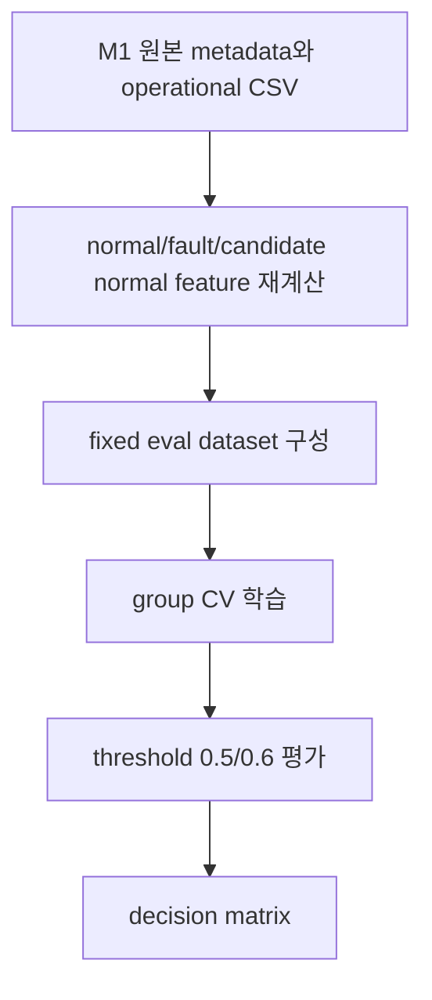

# M1 Normal vs Fault 전환 검증 보고서

## 개요

이번 검증은 `normal vs pre_event` 기준을 바로 버릴지 판단하기 전에, `normal vs fault_event`가 다음 main 목표가 될 수 있는지 확인한 작업이다.

최종 판단: **keep_pre_event_main_fault_event_auxiliary**

## 무엇을 했는지

- positive를 M1 `faults.csv`의 fault record로 재정의했다.
- main fixed eval은 normal 35건 + known fault 30건으로 구성했다.
- Event 20은 low coverage, Event 34는 unknown fault label, Event 69는 unknown fault label 및 `Training end` 없음으로 main에서 제외했다.
- Event 34 포함, Event 67 제외, Event 34 포함 + Event 67 제외를 sensitivity로 따로 계산했다.
- train-only candidate normal 70건을 붙인 경우와 붙이지 않은 경우를 비교했다.
- feature는 `compact13`과 `expanded154`를 분리해 저장했다.
- threshold 0.6을 의사결정 기준으로 쓰고, threshold 0.5도 recall 참고용으로 산출했다.

## 기존 07번 결과 재검토

기존 `normal vs fault_event` 실험은 lift가 작고 sensitivity가 안정적이지 않았다. 이번 검증은 같은 방향을 더 엄격한 fixed eval, candidate normal train-only, feature set 분리 기준으로 다시 본 것이다.

| dataset_id | rows | normal_rows | positive_rows | contains_event34 | contains_event67 | dummy_balanced_accuracy_mean | logistic_balanced_accuracy_mean | balanced_accuracy_lift_vs_dummy | logistic_precision_mean | logistic_recall_mean | logistic_f1_mean | logistic_roc_auc_mean | threshold05_false_positive_rate | threshold05_false_negative_rate | unknown_fault_rows | incomplete_training_metadata_rows |
| --- | --- | --- | --- | --- | --- | --- | --- | --- | --- | --- | --- | --- | --- | --- | --- | --- |
| fault_event_known_only | 65 | 35 | 30 | False | True | 0.5000 | 0.5363 | 0.0363 | 0.5022 | 0.5171 | 0.4824 | 0.5305 | 0.4571 | 0.5000 | 0 | 4 |
| fault_event_with_unknown34 | 66 | 35 | 31 | True | True | 0.5000 | 0.4167 | -0.0833 | 0.3343 | 0.3190 | 0.3231 | 0.3748 | 0.4857 | 0.6774 | 1 | 4 |
| fault_event_no_event67 | 65 | 35 | 30 | True | False | 0.5000 | 0.4304 | -0.0696 | 0.3581 | 0.4000 | 0.3737 | 0.3966 | 0.5429 | 0.6000 | 1 | 4 |

## Main 결과: fault_known_only_main, threshold 0.6

| feature_set | train_mode | model | rows | balanced_accuracy | precision | recall | f1 | false_positive_rate | false_positive_count | false_negative_count | fp_event_ids | fn_event_ids |
| --- | --- | --- | --- | --- | --- | --- | --- | --- | --- | --- | --- | --- |
| compact13 | candidate_normal_train | dummy_most_frequent | 65 | 0.5000 | 0.0000 | 0.0000 | 0.0000 | 0.0000 | 0 | 30 |  | 1,3,5,6,7,10,11,13,15,23,24,29,32,36,37,38,40,44,45,47,49,52,53,57,60,62,63,64,65,67 |
| compact13 | candidate_normal_train | logistic_balanced | 65 | 0.7952 | 0.8148 | 0.7333 | 0.7719 | 0.1429 | 5 | 8 | 18,27,28,33,59 | 11,15,29,36,44,45,52,63 |
| compact13 | fixed_only | dummy_most_frequent | 65 | 0.5000 | 0.0000 | 0.0000 | 0.0000 | 0.0000 | 0 | 30 |  | 1,3,5,6,7,10,11,13,15,23,24,29,32,36,37,38,40,44,45,47,49,52,53,57,60,62,63,64,65,67 |
| compact13 | fixed_only | logistic_balanced | 65 | 0.7310 | 0.7600 | 0.6333 | 0.6909 | 0.1714 | 6 | 11 | 18,27,28,33,59,68 | 11,13,15,23,29,36,37,44,52,63,65 |
| expanded154 | candidate_normal_train | dummy_most_frequent | 65 | 0.5000 | 0.0000 | 0.0000 | 0.0000 | 0.0000 | 0 | 30 |  | 1,3,5,6,7,10,11,13,15,23,24,29,32,36,37,38,40,44,45,47,49,52,53,57,60,62,63,64,65,67 |
| expanded154 | candidate_normal_train | logistic_balanced | 65 | 0.6310 | 0.6842 | 0.4333 | 0.5306 | 0.1714 | 6 | 17 | 18,19,27,28,59,68 | 5,11,13,15,23,29,32,36,37,38,40,44,45,49,52,64,65 |
| expanded154 | fixed_only | dummy_most_frequent | 65 | 0.5000 | 0.0000 | 0.0000 | 0.0000 | 0.0000 | 0 | 30 |  | 1,3,5,6,7,10,11,13,15,23,24,29,32,36,37,38,40,44,45,47,49,52,53,57,60,62,63,64,65,67 |
| expanded154 | fixed_only | logistic_balanced | 65 | 0.5667 | 0.5882 | 0.3333 | 0.4255 | 0.2000 | 7 | 20 | 18,19,28,54,59,61,68 | 5,6,11,13,15,23,24,29,32,36,37,38,40,44,45,52,62,63,64,65 |

## Sensitivity 결과: compact13 + candidate normal train, threshold 0.6

| dataset_id | rows | normal_rows | fault_rows | balanced_accuracy | precision | recall | f1 | false_positive_rate | false_positive_count | false_negative_count | fp_event_ids | fn_event_ids |
| --- | --- | --- | --- | --- | --- | --- | --- | --- | --- | --- | --- | --- |
| fault_known_only_main | 65 | 35 | 30 | 0.7952 | 0.8148 | 0.7333 | 0.7719 | 0.1429 | 5 | 8 | 18,27,28,33,59 | 11,15,29,36,44,45,52,63 |
| fault_no_event67 | 64 | 35 | 29 | 0.7877 | 0.8333 | 0.6897 | 0.7547 | 0.1143 | 4 | 9 | 27,28,33,59 | 11,13,15,29,36,44,45,52,63 |
| fault_with_unknown34 | 66 | 35 | 31 | 0.8120 | 0.8800 | 0.7097 | 0.7857 | 0.0857 | 3 | 9 | 19,27,28 | 11,15,29,34,36,44,45,47,63 |
| fault_with_unknown34_no_event67 | 65 | 35 | 30 | 0.7905 | 0.8696 | 0.6667 | 0.7547 | 0.0857 | 3 | 10 | 19,27,28 | 11,13,15,29,34,36,45,47,57,63 |

## Decision Matrix

| criterion | baseline_value | candidate_value | delta | pass | blocking_for_transition | final_decision |
| --- | --- | --- | --- | --- | --- | --- |
| dummy_lift_clear | 0.5000 | 0.7952 | 0.2952 | True | True | keep_pre_event_main_fault_event_auxiliary |
| recall_not_far_below_pre_event | 0.7857 | 0.7333 | -0.0524 | True | True | keep_pre_event_main_fault_event_auxiliary |
| fp_concentrated_in_known_hard_normals | 0.5000 | 0.4000 | -0.1000 | False | True | keep_pre_event_main_fault_event_auxiliary |
| candidate_normal_train_not_harmful | 0.7310 | 0.7952 | 0.0643 | True | True | keep_pre_event_main_fault_event_auxiliary |
| compact13_close_to_expanded154 | 0.6310 | 0.7952 | 0.1643 | True | True | keep_pre_event_main_fault_event_auxiliary |
| event34_sensitivity_policy | 0.7952 | 0.8120 | 0.0167 | True | False | keep_pre_event_main_fault_event_auxiliary |
| event67_sensitivity_policy | 0.7952 | 0.7877 | -0.0076 | True | False | keep_pre_event_main_fault_event_auxiliary |

## 해석

- Dummy 대비 main compact13 lift: `0.2952`.
- pre_event locked recall `0.7857` 대비 fault_event main compact13 recall은 `0.7333`이다.
- fault_event main compact13 FP 이벤트는 `18,27,28,33,59`, FN 이벤트는 `11,15,29,36,44,45,52,63`이다.
- hard normal Event 27/28/68 FP 집중도는 `0.4000`이다.
- Event 34 포함 sensitivity가 안정적이다.
- Event 67 제외 sensitivity가 main과 크게 다르지 않다.

## 변경 내용

| 항목 | 내용 |
| --- | --- |
| 노트북 | `06_노트북/15_m1_normal_vs_fault_transition_validation.ipynb` |
| audit | `m1_normal_vs_fault_transition_audit.csv` |
| feature pool | `m1_normal_vs_fault_transition_feature_pool.csv` |
| dataset summary | `m1_normal_vs_fault_transition_dataset_summary.csv` |
| metrics | `m1_normal_vs_fault_transition_cv_metrics.csv`, `m1_normal_vs_fault_transition_threshold_metrics.csv` |
| predictions | `m1_normal_vs_fault_transition_predictions.csv` |
| decision | `m1_normal_vs_fault_transition_decision_matrix.csv` |
| plots | `m1_normal_vs_fault_transition_decision_matrix.png`, `m1_normal_vs_fault_transition_feature_comparison.png` |

## 검증

- normal 35건을 유지했다.
- main fault positive는 30건이다.
- Event 20/34/69는 main에 포함되지 않았다.
- Event 34는 sensitivity에만 포함했다.
- Event 67은 main에 포함되고, sensitivity에서 제외 가능하게 분리했다.
- Event 27/28/68 normal tag를 유지했다.
- fold별 train/test `substation_id` overlap은 0이다.
- `compact13=13`, `expanded154=154` feature 결과를 분리 저장했다.

## 한계와 주의점

- 이 실험은 조기탐지가 아니라 fault record 상태 구분 가능성 검증이다.
- normal 라벨은 변경하지 않았다.
- threshold 0.6은 비교 기준이며 운영 threshold로 확정한 것이 아니다.
- final model 저장이나 배포는 하지 않았다.

## 다음에 볼 것

- final decision이 `keep_pre_event_main_fault_event_auxiliary`이면, 현재는 `normal vs pre_event`를 main으로 유지하고 fault_event는 보조 실험으로 둔다.
- final decision이 `normal_vs_fault_transition_candidate_main_known_fault`이면, known fault 30건 기준으로 다음 학습 계획을 세운다.
