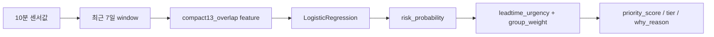

# M1 Fault Priority Runtime Policy 설명서

## 0. 먼저 보는 용어정리
처음 읽을 때 막히는 단어는 아래 표를 먼저 보면 된다.

| term | plain_korean_definition | why_it_matters |
| --- | --- | --- |
| M1 | 이번 분석에서 사용한 대상 제조사 데이터 범위 | 비대상 제조사와 섞지 않기 위한 기준 |
| fault | 고장 기록 또는 고장 이벤트 | 이번 설명서는 fault만 다루고 task/activity는 제외 |
| pre_event | 고장 보고 전에 센서 패턴에서 위험 신호가 보이는 구간 | 조기탐지 모델의 positive 개념 |
| runtime | 실제로 10분 센서값이 들어올 때 적용되는 판단 흐름 | 분석 노트북이 아니라 운영 시나리오 관점 |
| 7일 window | 최근 7일 센서값을 묶은 계산 구간 | feature 계산의 입력 단위 |
| compact13_overlap | 모델이 쓰는 13개 요약 feature | 최근 변화, 온도 gap, setpoint 관련 신호 중심 |
| LogisticRegression | 현재 pre-event 위험확률을 내는 기준 모델 | 복잡한 모델보다 해석과 안정성을 우선 |
| risk_probability | pre-event 모델이 낸 위험 확률 | priority score에서 가장 큰 비중 |
| threshold 0.6 | 위험 후보로 볼 확률 기준 | 0.6 이상이면 pre-event 후보 |
| stable crossing | 한 번 넘은 뒤 가까운 시점에서도 계속 threshold를 넘는 시점 | 공식 리드타임 기준 |
| leadtime_urgency | 리드타임을 출동 긴급도로 바꾼 값 | 짧을수록 긴급하게 처리 |
| fault_group | fault label을 운영 해석용으로 묶은 고장군 | 예: pump_failure, leakage_water_loss |
| group_weight | 고장군 빈도와 monitoring potential을 반영한 보조 점수 | 개별 위험확률을 뒤집지 않도록 낮은 비중 |
| priority_score | risk, leadtime, group을 합친 정책 점수 | ML 모델이 아니라 운영 정책 후보 |
| priority_tier | score를 high/medium/low/monitor로 나눈 단계 | 출동 우선순위 표시용 |
| review_flag | 해석 주의가 필요한 이벤트 표시 | unknown, low coverage, long anomaly 등 |
| policy v1 candidate | 현재 데이터에서 설명 가능한 운영 후보 | 현장 비용/SLA 검증 전 최종 확정값은 아님 |

## 1. 한 장 요약
- 이 문서는 M1 fault에 대해서만 다룬다. task/activity는 범위에서 제외한다.
- 목표는 10분 단위 센서값이 들어왔을 때 `위험확률`, `리드타임 해석`, `우선순위`, `이유 문장`을 내보내는 기준을 설명하는 것이다.
- 새 모델은 만들지 않는다. 28번 pre-event 모델, 29번 리드타임 audit, 30번 가중치 민감도 audit을 이어 붙인다.
- 현재 운영 후보는 `policy v1 candidate`다. 현장 비용/SLA 검증 전 최종 확정값이라고 쓰지 않는다.

## 2. 전체 흐름

## 3. 현재 잠긴 기준
| 항목 | 현재 기준 |
| --- | --- |
| 입력 단위 | 최근 7일 sensor window |
| feature | `compact13_overlap` 13개 |
| pre-event model | `LogisticRegression(class_weight=balanced)` |
| threshold | `0.6` |
| pre-event lock decision | `fault_pre_event_gate_v1_locked_for_M1` |
| priority formula | `100 * (0.55*risk_probability + 0.30*leadtime_urgency + 0.15*group_weight)` |
| priority decision | `baseline_28_keep_as_policy_v1` |

## 4. 고장군별 해석
| fault_group | event_count | stable_crossing_detection_rate | median_stable_lead_time_days | leadtime_label | leadtime_confidence | operational_meaning |
| --- | --- | --- | --- | --- | --- | --- |
| control_controller | 12 | 0.833 | 0.000 | report_time_only | high | same_day_fault_signal |
| pump_failure | 5 | 0.800 | 0.500 | short_stable | high | short_leadtime_warning_candidate |
| valve_actuator | 4 | 0.500 | 3.500 | early_stable | medium | days_before_warning_candidate |
| pressure_regulator | 4 | 1.000 | 0.000 | report_time_only | high | same_day_fault_signal |
| leakage_water_loss | 4 | 0.750 | 7.000 | early_stable | high | days_before_warning_candidate |
| unknown_review | 0 |  |  | review_only | review | manual_review_only |

읽는 법은 단순하다.
- `early_stable`: 며칠 전부터 잡히는 고장군 후보
- `short_stable`: 짧은 리드타임으로 잡히는 고장군 후보
- `report_time_only`: 당일성 신호에 가까운 고장군
- `review_only`: 자동 판단보다 수동 검토가 먼저인 고장군

## 5. Runtime 출력 스키마
Agent 또는 서비스가 내보내야 하는 최소 필드는 아래와 같다.

| field_name | type | plain_korean_meaning | source | required |
| --- | --- | --- | --- | --- |
| substation_id | int | 센서가 들어온 기계실 ID | runtime input | yes |
| window_start | datetime | 최근 7일 window 시작 | runtime calculation | yes |
| window_end | datetime | 최근 7일 window 끝 | runtime calculation | yes |
| risk_probability | float | pre-event 위험확률 | LogisticRegression | yes |
| risk_prediction | int | threshold 0.6 이상 여부 | risk_probability >= 0.6 | yes |
| fault_group | string | 가장 가까운 해석용 고장군 | fault group taxonomy | yes |
| leadtime_label | string | 고장군별 리드타임 성격 | 29번 stable lead-time audit | yes |
| leadtime_urgency | float | 출동 긴급도 점수 | 28번 priority logic | yes |
| group_weight | float | 고장군 보조 가중치 | 28번 group profile | yes |
| priority_score | float | 최종 정책 점수 | 0.55*risk + 0.30*leadtime + 0.15*group | yes |
| priority_tier | string | high/medium/low/monitor | priority score and risk threshold | yes |
| why_reason | string | 사람에게 보여줄 판단 이유 | runtime explanation | yes |
| review_flag | bool | 수동 검토 필요 여부 | event flags and unknown label | yes |
| recommended_action | string | 권장 조치 | priority tier and leadtime label | yes |

## 6. Runtime 출력 예시
아래 예시는 실제 28~30번 산출물에서 뽑은 event다.

| case_type | event_id | substation_id | fault_group | risk_probability | leadtime_label | priority_score | priority_tier | review_flag | why_reason | recommended_action |
| --- | --- | --- | --- | --- | --- | --- | --- | --- | --- | --- |
| top_priority_high | 3 | 12 | control_controller | 0.985 | report_time_only | 99.197 | high | False | 위험확률 0.99; priority score 99.2; 고장군 control_controller; 당일성 신호 고장군 | 우선 확인: 현장/원격 점검 후보 |
| early_leadtime_medium | 10 | 30 | leakage_water_loss | 1.000 | early_stable | 73.661 | medium | False | 위험확률 1.00; priority score 73.7; 고장군 leakage_water_loss; 며칠 전부터 잡히는 고장군 | 계획 점검: 며칠 전 신호이므로 추세 확인 후 일정 배정 |
| early_leadtime_high | 65 | 11 | leakage_water_loss | 0.845 | early_stable | 83.115 | high | False | 위험확률 0.84; priority score 83.1; 고장군 leakage_water_loss; 며칠 전부터 잡히는 고장군 | 우선 확인: 현장/원격 점검 후보 |
| short_leadtime_high | 5 | 11 | pump_failure | 0.984 | short_stable | 93.639 | high | False | 위험확률 0.98; priority score 93.6; 고장군 pump_failure; 짧은 리드타임 고장군 | 우선 확인: 현장/원격 점검 후보 |
| report_time_signal_high | 49 | 18 | control_controller | 0.961 | report_time_only | 97.842 | high | False | 위험확률 0.96; priority score 97.8; 고장군 control_controller; 당일성 신호 고장군 | 우선 확인: 현장/원격 점검 후보 |
| review_only_case | 69 | 26 | unknown_review | 0.988 | review_only | 85.818 | high | True | 위험확률 0.99; priority score 85.8; 고장군 unknown_review; 수동 검토 고장군; review flag 존재 | 수동 검토: unknown fault label이므로 자동 출동 확정 전 확인 |
| monitor_case | 11 | 4 | valve_actuator | 0.000 | early_stable | 8.714 | monitor | True | 위험확률 0.00; priority score 8.7; 고장군 valve_actuator; 며칠 전부터 잡히는 고장군; review flag 존재 | monitor: threshold 미만 또는 근거 부족, 자동 출동 제외 |

## 7. 왜 이렇게 했나

### 왜 LogisticRegression인가
- 현재 M1 positive 샘플이 작아서 복잡한 모델보다 안정성과 설명 가능성이 중요하다.
- 28번에서 `compact13_overlap + LogisticRegression + threshold 0.6`이 잠금 기준을 통과했다.

### 왜 threshold 0.6인가
- threshold 0.6은 normal false positive를 과도하게 키우지 않으면서 pre-event recall을 유지한 기준이다.
- 현재 성능은 balanced accuracy `0.850`, recall `0.786`, normal FPR `0.086`다.

### 왜 stable crossing인가
- 한 번만 threshold를 넘는 `first crossing`은 순간 spike일 수 있다.
- `stable crossing`은 그 이후 가까운 anchor에서도 계속 threshold를 넘는 기준이라 운영 해석에 더 안전하다.

### 왜 가중치 0.55 / 0.30 / 0.15인가
- `risk_probability`는 실제 모델이 낸 개별 event 위험확률이라 가장 크게 둔다.
- `leadtime_urgency`는 출동 여유를 반영하므로 두 번째로 둔다.
- `group_weight`는 빈도와 monitoring potential 기반 보조 정보이므로 가장 작게 둔다.
- 30번 민감도 audit에서 `baseline_28`은 top10 overlap `1.000`, high tier ratio `0.636`로 guardrail을 통과했다.

## 8. 한계와 다음 단계
- priority score는 ML 모델이 아니라 정책 score다.
- M1 fault event는 33건이라 가중치 학습은 아직 과적합 위험이 크다.
- 현장 출동 비용, 피해 규모, SLA 데이터가 생기면 priority weight를 다시 검증해야 한다.
- 지금 단계의 올바른 표현은 `M1 fault priority policy v1 candidate`다.

## 9. 뒤에도 보는 용어정리
앞에서 본 용어를 다시 붙인다. 읽다가 모르는 단어가 나오면 이 표로 돌아오면 된다.

| term | plain_korean_definition | why_it_matters |
| --- | --- | --- |
| M1 | 이번 분석에서 사용한 대상 제조사 데이터 범위 | 비대상 제조사와 섞지 않기 위한 기준 |
| fault | 고장 기록 또는 고장 이벤트 | 이번 설명서는 fault만 다루고 task/activity는 제외 |
| pre_event | 고장 보고 전에 센서 패턴에서 위험 신호가 보이는 구간 | 조기탐지 모델의 positive 개념 |
| runtime | 실제로 10분 센서값이 들어올 때 적용되는 판단 흐름 | 분석 노트북이 아니라 운영 시나리오 관점 |
| 7일 window | 최근 7일 센서값을 묶은 계산 구간 | feature 계산의 입력 단위 |
| compact13_overlap | 모델이 쓰는 13개 요약 feature | 최근 변화, 온도 gap, setpoint 관련 신호 중심 |
| LogisticRegression | 현재 pre-event 위험확률을 내는 기준 모델 | 복잡한 모델보다 해석과 안정성을 우선 |
| risk_probability | pre-event 모델이 낸 위험 확률 | priority score에서 가장 큰 비중 |
| threshold 0.6 | 위험 후보로 볼 확률 기준 | 0.6 이상이면 pre-event 후보 |
| stable crossing | 한 번 넘은 뒤 가까운 시점에서도 계속 threshold를 넘는 시점 | 공식 리드타임 기준 |
| leadtime_urgency | 리드타임을 출동 긴급도로 바꾼 값 | 짧을수록 긴급하게 처리 |
| fault_group | fault label을 운영 해석용으로 묶은 고장군 | 예: pump_failure, leakage_water_loss |
| group_weight | 고장군 빈도와 monitoring potential을 반영한 보조 점수 | 개별 위험확률을 뒤집지 않도록 낮은 비중 |
| priority_score | risk, leadtime, group을 합친 정책 점수 | ML 모델이 아니라 운영 정책 후보 |
| priority_tier | score를 high/medium/low/monitor로 나눈 단계 | 출동 우선순위 표시용 |
| review_flag | 해석 주의가 필요한 이벤트 표시 | unknown, low coverage, long anomaly 등 |
| policy v1 candidate | 현재 데이터에서 설명 가능한 운영 후보 | 현장 비용/SLA 검증 전 최종 확정값은 아님 |
