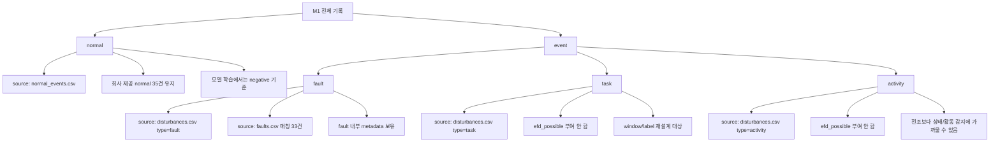
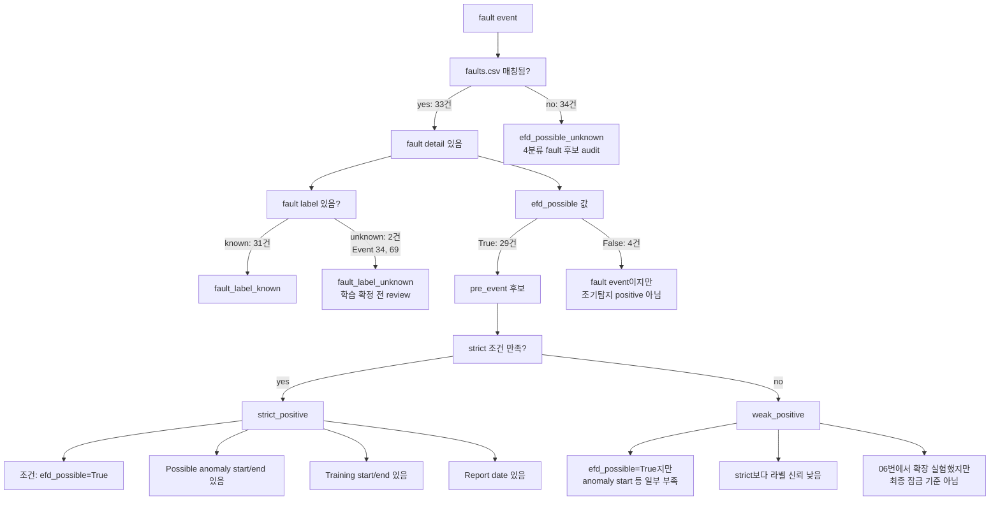
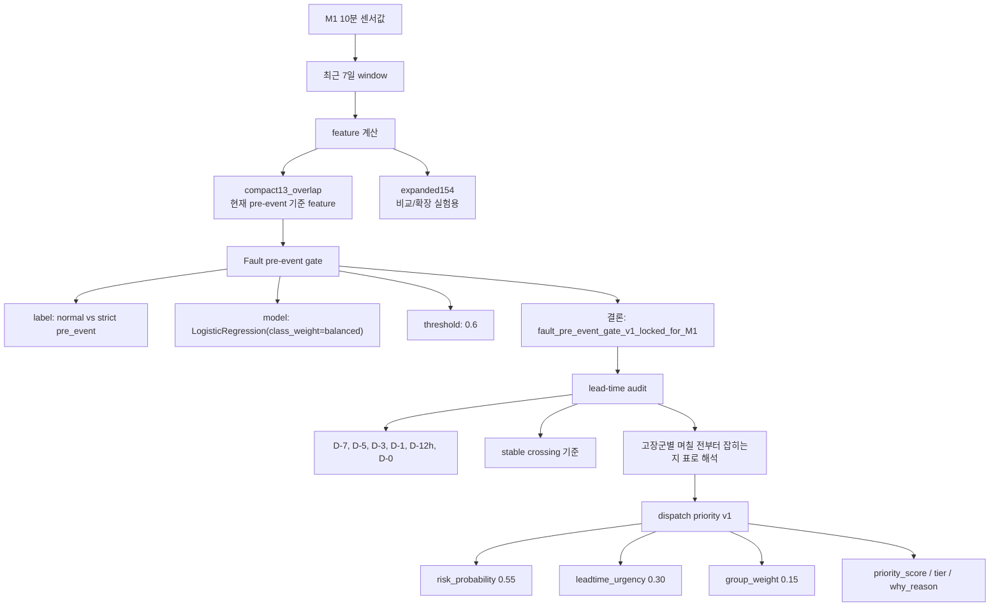
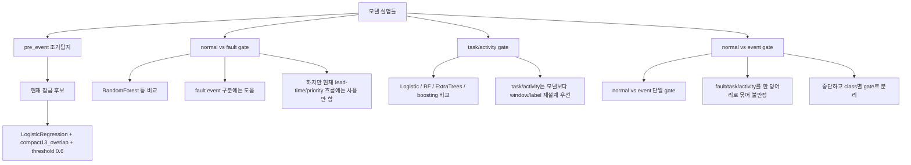

# M1 Label Taxonomy / Model / Rule 다이어그램

## 1. 전체 Label 구조



핵심은 이거다.

| 단계 | 현재 의미 |
| --- | --- |
| `normal` | 회사가 정상이라고 준 35개 window |
| `event` | disturbance 기반 이벤트 전체 |
| `fault/task/activity` | event를 다시 나눈 최종 목표 class |
| `efd_possible` | fault 안에서만 쓰는 metadata, 최상위 class가 아님 |

## 2. Fault 내부 Label 흐름



## 3. Strict / Weak 처리 규칙

| 구분 | 쓰임 | 규칙 | 현재 결론 |
| --- | --- | --- | --- |
| `strict_positive` | 조기탐지 pre-event 핵심 positive | `efd_possible=True`이고 anomaly/training/report metadata가 충분한 fault | 현재 pre-event 기준의 중심 |
| `weak_positive` | positive 확장 후보 | `efd_possible=True`지만 strict 조건 일부 부족 | 실험은 했지만 최종 잠금 기준은 아님 |
| `Event 20` | strict 후보였지만 coverage 낮음 | 7일 window coverage 부족 | 학습/평가 제외, audit 유지 |
| `Event 34` | unknown fault label | label 판단 불명확 | 학습 제외, review |
| `Event 69` | unknown + Training end 없음 | metadata 부족 | 학습 제외, review |
| `Event 67` | long anomaly | 장기 anomaly flag | main에는 포함, sensitivity에서 확인 |

## 4. 모델이 붙는 위치



## 5. 다른 모델들은 어디에 있었나



## 6. 한 줄 결론

현재 가장 중요한 운영 흐름은 아래 하나다.

```text
M1 센서값
→ 최근 7일 window
→ compact13_overlap feature
→ LogisticRegression
→ pre_event 위험확률
→ threshold 0.6
→ 고장군별 lead-time audit
→ priority score
```

그리고 `normal / fault / task / activity` 4분류는 아직 최종 모델이 아니라 아래 순서로 가는 중이다.

```text
1. normal vs fault는 먼저 잠금 가능성 있음
2. fault 내부에서는 pre_event 조기탐지 흐름이 가장 많이 정리됨
3. task/activity는 label/window 정책을 더 정리해야 함
4. efd_possible은 fault 내부 속성이지 class label이 아님
```

## 7. 용어 다시 보기

| 용어 | 쉬운 뜻 |
| --- | --- |
| `taxonomy` | label을 어떤 층으로 나눌지 정한 구조 |
| `metadata` | 정답 label은 아니지만 판단에 참고하는 정보 |
| `efd_possible` | 이 fault가 조기탐지 후보인지 나타내는 fault 내부 정보 |
| `strict_positive` | metadata가 충분해서 조기탐지 positive로 믿고 쓰는 fault |
| `weak_positive` | positive 후보지만 strict보다 근거가 약한 fault |
| `compact13_overlap` | 현재 조기탐지 모델이 쓰는 13개 feature |
| `threshold 0.6` | 위험확률이 0.6 이상이면 pre_event로 보는 기준 |
| `lead-time audit` | 며칠 전부터 threshold를 넘는지 확인한 표 |
| `priority score` | 위험확률, 리드타임, 고장군 가중치를 합친 운영 점수 |
