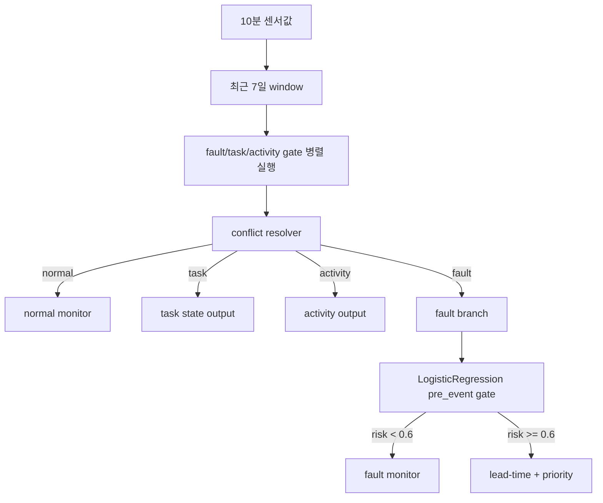

# M1 Full Gate Lock 및 Runtime Rule 적용 보고서

## 결론
- 최종 판단: `full_gate_runtime_policy_v1_candidate_locked`
- 운영 구조는 단일 4분류 모델이 아니라 `fault/task/activity` binary gate 3개를 병렬로 돌리고 conflict resolver로 최종 상태를 정한다.
- `RandomForest`는 앞단 gate에 사용하고, `LogisticRegression`은 fault로 들어온 뒤 `pre_event` 위험확률을 계산할 때만 사용한다.
- fault pre-event, lead-time, priority score는 28~30번 잠금 기준을 그대로 유지했다.
- task/activity는 조기탐지라기보다 작업/상태 감지 gate로 문서화했다.

## Runtime Flow

## Gate 잠금 결과
| gate | target_class | dataset | feature_set | model | threshold | rows | balanced_accuracy | target_recall | normal_fpr | tn | fp | fn | tp |
| --- | --- | --- | --- | --- | --- | --- | --- | --- | --- | --- | --- | --- | --- |
| fault_gate | fault | fault_no_overlap | compact13 | random_forest_balanced_depth3 | 0.5000 | 90 | 0.8455 | 0.8909 | 0.2000 | 28 | 7 | 6 | 49 |
| task_gate | task | task_post_1d | compact13 | random_forest_balanced_depth3 | 0.5000 | 77 | 1.0000 | 1.0000 | 0.0000 | 35 | 0 | 0 | 42 |
| activity_gate | activity | activity_pre_1d | compact13 | random_forest_balanced_depth3 | 0.5000 | 82 | 1.0000 | 1.0000 | 0.0000 | 35 | 0 | 0 | 47 |

## Decision Matrix
| component | dataset | feature_set | model | threshold | balanced_accuracy | target_recall | normal_fpr | decision | overall_runtime_decision |
| --- | --- | --- | --- | --- | --- | --- | --- | --- | --- |
| fault_gate | fault_no_overlap | compact13 | random_forest_balanced_depth3 | 0.5000 | 0.8455 | 0.8909 | 0.2000 | fault_gate_locked_for_runtime_v1_with_threshold_review | full_gate_runtime_policy_v1_candidate_locked |
| task_gate | task_post_1d | compact13 | random_forest_balanced_depth3 | 0.5000 | 1.0000 | 1.0000 | 0.0000 | task_gate_locked_as_state_detector_v1 | full_gate_runtime_policy_v1_candidate_locked |
| activity_gate | activity_pre_1d | compact13 | random_forest_balanced_depth3 | 0.5000 | 1.0000 | 1.0000 | 0.0000 | activity_gate_locked_for_runtime_v1 | full_gate_runtime_policy_v1_candidate_locked |
| fault_pre_event_gate | strict_no_event20_fixed_eval | compact13_overlap | LogisticRegression(class_weight=balanced) | 0.6000 | 0.8500 | 0.7857 | 0.0857 | fault_pre_event_gate_v1_locked_for_M1 | full_gate_runtime_policy_v1_candidate_locked |
| priority_policy | fault_dispatch_priority_v1 | risk_probability|leadtime_urgency|group_weight | policy_score_not_ml_model |  |  |  |  | baseline_28_keep_as_policy_v1 | full_gate_runtime_policy_v1_candidate_locked |

## Conflict Resolver

| primary_state | rows |
| --- | --- |
| fault | 56 |
| activity | 47 |
| task | 42 |
| normal | 34 |

### Resolver 규칙
| component | input | feature_or_signal | model_or_rule | threshold | output | note |
| --- | --- | --- | --- | --- | --- | --- |
| fault_gate | recent 7d window | compact13 | RandomForest depth3 | 0.50 | fault probability | front gate; threshold sensitive |
| task_gate | task_post_1d window | compact13 | RandomForest depth3 | 0.50 | task state flag | state/work detector, not pre-event |
| activity_gate | activity_pre_1d window | compact13 | RandomForest depth3 | 0.50 | activity flag | pre/post policy still monitored |
| conflict_resolver | three gate outputs | gate probabilities | deterministic rule |  | primary_state | fault priority over task/activity |
| fault_pre_event_gate | fault branch only | compact13_overlap | LogisticRegression balanced | 0.60 | risk_probability | locked in report 28 |
| leadtime_audit | fault branch with risk >=0.6 | anchor probabilities | stable crossing rule | 0.60 | leadtime label | not a regression model |
| priority_policy | fault branch with risk >=0.6 | risk|leadtime|group | policy score |  | priority_score/tier | baseline_28 weights |

## Runtime Output Schema
| field_name | type | plain_korean_meaning | source | required |
| --- | --- | --- | --- | --- |
| sample_id | string | runtime 판단 단위 ID | window/gate input | True |
| substation_id | integer | 기계실 ID | input metadata | True |
| window_start | datetime | 최근 window 시작 | feature window | True |
| window_end | datetime | 최근 window 끝 | feature window | True |
| fault_probability | float | fault gate 확률 | RandomForest fault gate | True |
| task_probability | float | task gate 확률 | RandomForest task gate | True |
| activity_probability | float | activity gate 확률 | RandomForest activity gate | True |
| primary_state | string | 최종 상태 normal/fault/task/activity | conflict resolver | True |
| secondary_tags | string | 동시에 켜진 보조 tag | conflict resolver | False |
| review_flag | boolean | 수동 검토 필요 여부 | conflict resolver | True |
| risk_probability | float | fault pre_event 위험확률 | LogisticRegression pre_event gate | False |
| priority_score | float | 출동 우선순위 점수 | policy score | False |
| priority_tier | string | high/medium/low/monitor | policy score | False |
| why_reason | string | 최종 판단 이유 | runtime rules | True |

## Runtime Example
| example_type | source_id | substation_id | primary_state | secondary_tags | fault_probability | task_probability | activity_probability | risk_probability | priority_score | priority_tier | review_flag | why_reason |
| --- | --- | --- | --- | --- | --- | --- | --- | --- | --- | --- | --- | --- |
| normal_example | disturbance_0006 | 3.0000 | normal |  | 0.3089 |  |  |  |  |  | False | no gate crossed threshold |
| fault_priority_example | disturbance_0059 | 12.0000 | fault |  | 0.8588 |  |  | 0.9854 | 99.1972 | high | False | fault gate crossed threshold; fault has runtime priority |
| task_example | disturbance_0017_task_post_1d | 5.0000 | task |  |  | 0.9851 |  |  |  |  | False | task gate crossed threshold |
| activity_example | disturbance_0002_activity_pre_1d | 3.0000 | activity |  |  |  | 0.9656 |  |  |  | False | activity gate crossed threshold |
| review_example | normal_0019 | 8.0000 | fault |  | 0.7114 | 0.1500 | 0.1441 |  |  |  | True | fault gate crossed threshold; fault has runtime priority |

## 근거
- fault gate는 `fault_no_overlap + compact13 + RandomForest depth3 + threshold 0.5`에서 기준을 통과했다.
- task gate는 `task_post_1d + compact13 + RandomForest depth3 + threshold 0.5`를 상태 감지 후보로 잠갔다.
- activity gate는 `activity_pre_1d + compact13 + RandomForest depth3 + threshold 0.5`를 후보로 잠갔다.
- pre-event gate는 `compact13_overlap + LogisticRegression + threshold 0.6`이며 28번 수치와 변경 없이 연결했다.
- priority 공식은 `100 * (0.55*risk_probability + 0.30*leadtime_urgency + 0.15*group_weight)`를 유지했다.

## 한계
- fault gate는 threshold 0.5에서 통과하지만 주변 threshold에서 결론이 흔들리므로 `runtime v1 candidate`로 표현한다.
- task/activity는 성능이 매우 높아 window-policy 착시 가능성을 계속 추적해야 한다.
- priority는 ML 모델이 아니라 정책 score다.
- 이 결과는 M1 기준이며, 다른 제조사나 실시간 운영 데이터로 일반화되었다고 보지 않는다.

## 다음 작업 순서
1. runtime rule table을 기준으로 실제 10분 센서 입력용 feature 계산 함수를 분리한다.
2. task/activity gate가 실제 운영 이벤트와 맞는지 현장 의미를 검토한다.
3. fault gate threshold 0.5를 운영 비용 기준으로 재검토한다.
4. M1 외 데이터 적용은 별도 검증 후 진행한다.

## 품질 검증
| check | pass | detail |
| --- | --- | --- |
| m1_only_scope | True | all generated report text scoped to M1 |
| non_target_manufacturer_absent | True |  |
| normal_35_retained | True | 35 |
| special_fault_events_retained | True | 20/34/67/69 in priority/audit source |
| hard_normal_metadata_retained | True | 19|35|48|68 |
| gate_group_overlap_zero | True | source metrics report group_overlap_count 0 |
| pre_event_lock_unchanged | True | fault_pre_event_gate_v1_locked_for_M1 |
| conflict_resolver_deterministic | True | {'fault': 56, 'activity': 47, 'task': 42, 'normal': 34} |
| priority_only_for_fault_primary | True | non-fault rows have blank priority_score |
| runtime_schema_examples_present | True | schema and examples generated |
| source_zip_metadata_not_modified_by_script | True | script writes only 07 outputs and 06 notebook |
| png_outputs_exist | True | m1_full_gate_runtime_flow.png|m1_full_gate_conflict_resolution.png |
