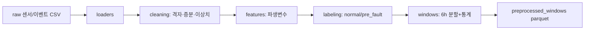

# 전처리 파이프라인 검토 보고서 (manufacturer 1)

## Overview

`pipeline/` 신규 폴더에 **지역난방 고장 예측용 전처리 파이프라인**을 모듈로 구현하고 검토한다.
이 파이프라인은 `raw 센서/이벤트 → 전처리 → preprocessed_windows(6시간 window tabular)` 흐름에서
**전처리 데이터까지**를 고정한다. feature selection·imputation·모델별 feature set은 이후 단계로 분리한다.

참고: `Heat_Grid_Agent`의 `00_operational_input_contract_review.md`,
`01_preprocessed_data_contract_review.md`에서 정의한 계약(4 raw 테이블,
`preprocessed_windows` grain)과 **동일한 관측 단위**(설비 × 6시간 window)를 따른다.
다만 본 구현은 그 계약의 **MVP 부분집합**(공통 센서·핵심 통계)으로, DB DDL/JSON Schema 없이
parquet 산출에 집중한다.

## What Changed

| 항목 | 내용 |
|---|---|
| 추가 폴더 | `pipeline/` (신규) |
| 추가 코드 | `config.py`, `loaders.py`, `cleaning.py`, `labeling.py`, `features.py`, `windows.py`, `run_preprocessing.py` |
| 산출물 | `data/processed/m1_windows_{3d,5d,7d}.parquet` (+ preview/label_intervals/legend/horizon_compare/missing_report) |
| grain | 설비 1개 × 6시간 window 1개 |
| PK 성격 | `(substation_id, window_start, window_end)` |
| 라벨 | `normal` / `pre_fault` (B 방법) |
| horizon | 3일 / 5일 / 7일 3버전 |
| 계약 범위 | 전처리 데이터까지 (feature engineering 제외) |

## Why This Approach

전처리 데이터는 모델 실험과 무관한 **재사용 가능한 표준 관측 단위**다. 이 층을 고정하면
이후 feature selection·모델 버전이 바뀌어도 동일 입력을 재사용할 수 있다.

코드는 참조 계약과 동일하게 **단순 함수형 파이프라인**으로 두고, DB repository/service 계층은
만들지 않는다. dataframe 입력 → 계약 컬럼 순서의 window dataframe 반환에 집중한다.
one-hot·imputation·selected feature list는 모델 정책에 따라 바뀌므로 이번 범위에서 제외한다.

## Change Details

### 파일별 책임
| 파일 | 책임 |
|---|---|
| `config.py` | 경로·컬럼·window·horizon·이상치 규칙 (전역 설정) |
| `loaders.py` | CSV 로드, faults 세미콜론 방어, 공통 컬럼 자동 탐색 |
| `cleaning.py` | 10분 격자 리샘플, 누적→증분, 결측/급점프 방어 |
| `labeling.py` | B 방법 pre_fault/normal 구간, time_bucket |
| `features.py` | 파생변수(dev/dT/energy_diff/volume_diff), window 통계, legend |
| `windows.py` | 6h window 분할, 메타 부여, 결측률 리포트 |
| `run_preprocessing.py` | 오케스트레이터 (실행 진입점) |

### 컬럼 구성
| 컬럼 그룹 | 산출 | 컬럼 수 |
|---|---|---:|
| 메타(식별/시간/라벨/lineage) | 고정 | 8 |
| numeric 변수 통계 | 11 변수 × 5 통계(mean/std/min/max/slope) | 55 |
| **합계** | | **63** |

- numeric 변수 11 = 원본 7 (외기·난방공급·목표·환수·1차공급·열출력·유량)
  + 증분 2 (energy_diff·volume_diff) + 파생 2 (dev·dT).
- 메타: `substation_id`, `window_start`, `window_end`, `label`, `horizon_version`,
  `time_bucket`, `event_id`, `coverage`.

> 참조 계약의 `preprocessed_windows`(211 컬럼: numeric 17×9, control 11×3, context 등) 대비,
> 본 MVP는 **공통 numeric 11×5**만 사용한다. control/status·DHW·풍부한 통계는 2단계 확장 대상.

### 핵심 규칙 (B 방법 라벨링)
- `pre_fault`: **efd=True + 라벨 가능** fault만. 끝점=`Report date`,
  시작점=`Possible anomaly start`(없으면 `Report date − horizon`), 최대 7일 cap.
- `normal`: `normal_events.csv` 구간만 사용 (정상 오염 방지).
- `task`/`activity`/미라벨 fault·efd=False는 이번 단계 제외.
- `time_bucket`: `Report date`까지 남은 시간 → `0_24h`/`1_3d`/`3_7d`, normal은 `normal`.

## Verification

실행한 검증은 다음과 같다. (`python pipeline/run_preprocessing.py` 후 산출물 감사)

| 검증 | 결과 |
|---|---|
| 파이프라인 실행 | 정상 완료 (exit 0) |
| horizon별 window 수 | 3d 1270 / 5d 1382 / 7d 1494 |
| normal/pre_fault | 980 / (290·402·514) |
| 피처 수 | 55 (11변수×5통계) |
| 파생변수 값 sanity | dev −32~52, dT −1~70, energy_diff ≥ 0 |
| time_bucket 일관성 | 위반 0 (normal↔pre_fault 안 섞임) |
| window coverage | 최소 0.972 (≥ 0.5 기준) |
| **시간 누수** | pre_fault window_end > anchor 위반 **0** |
| **정상 오염** | 동일 window가 normal+pre_fault 중복 **0** |
| 증분 이상치 | energy_diff 음수 **0** (reset→NaN 반영) |
| 전체 결측률 | 피처 평균 1.4~1.6% |

실행하지 못한 검증은 다음과 같다.

| 미실행 검증 | 사유 |
|---|---|
| DB DDL/JSON Schema 정합성 | 본 MVP는 parquet 산출만, 형식 계약(SQL/JSON) 미작성 |
| 설비별 결측률 상세 (전 설비) | 상위 8개만 체크포인트 출력, 전 설비 개별 감사 미실행 |
| 3d/5d 버전 개별 8종 감사 | 7d만 전수 감사, 3d/5d는 요약 수치만 확인 |

## Limits and Caveats

- 이 계약은 **전처리 데이터까지만** 고정한다. feature selection·imputation·모델 feature set은 별도.
- 참조 계약(211 컬럼·4 raw 테이블·SQL/JSON Schema) 대비 **형식 계약이 없다.**
  현재는 코드+parquet 산출이며, DB hypertable·스키마 검증은 미도입.
- `dT`/`energy` 계열 결측 ~2.5%는 일부 설비에 원본 컬럼이 없어서 발생(설비마다 컬럼 상이) → 정상.
- 라벨 품질은 `Possible anomaly start`(전문가 추정)·고정 horizon에 의존 → 라벨 노이즈 잔존.
- manufacturer 2는 사용하지 않는다(범위 밖).

## Next Steps

1. 3d/5d 버전에도 7d와 동일한 전수 품질 감사를 적용한다.
2. `preprocessed_windows` 형식 계약(컬럼·타입·PK) 문서/스키마를 작성해 참조 계약 수준으로 승격한다.
3. 2단계 확장: DHW 센서, control/status 요약, 풍부한 통계(first/last/delta/missing_rate)를 추가한다.
4. 이후 feature engineering·train/test 분할(설비/시간 기준)을 별도 계약으로 분리한다.
