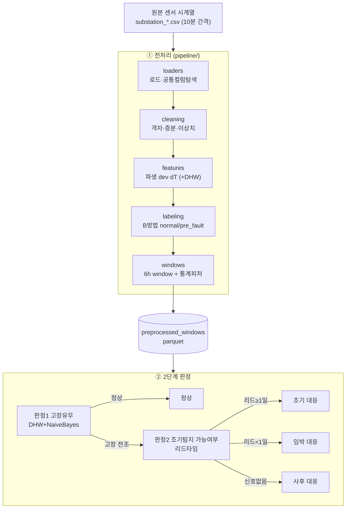
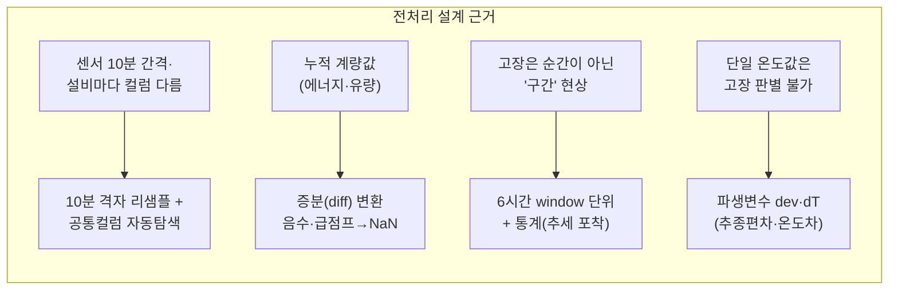
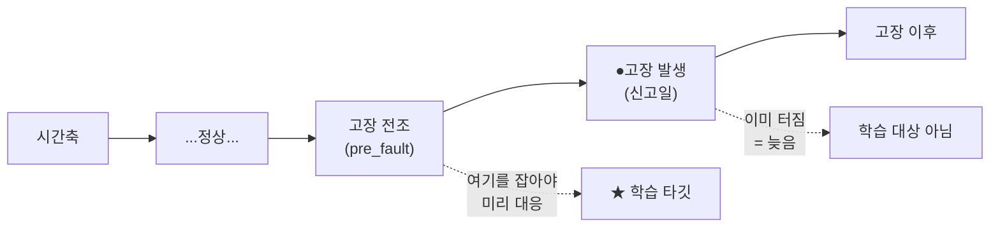
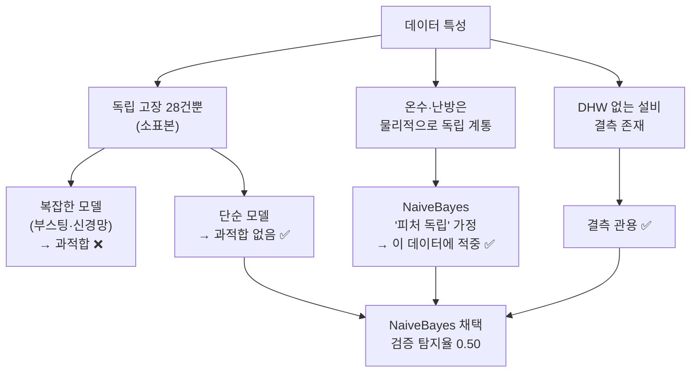
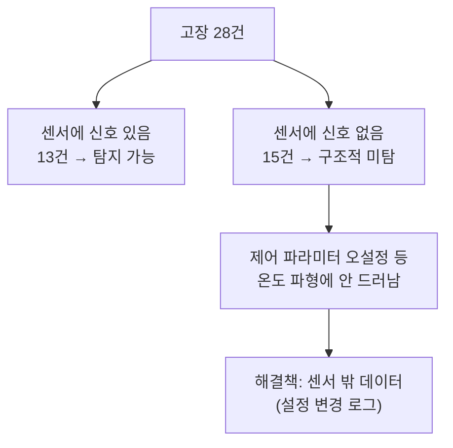
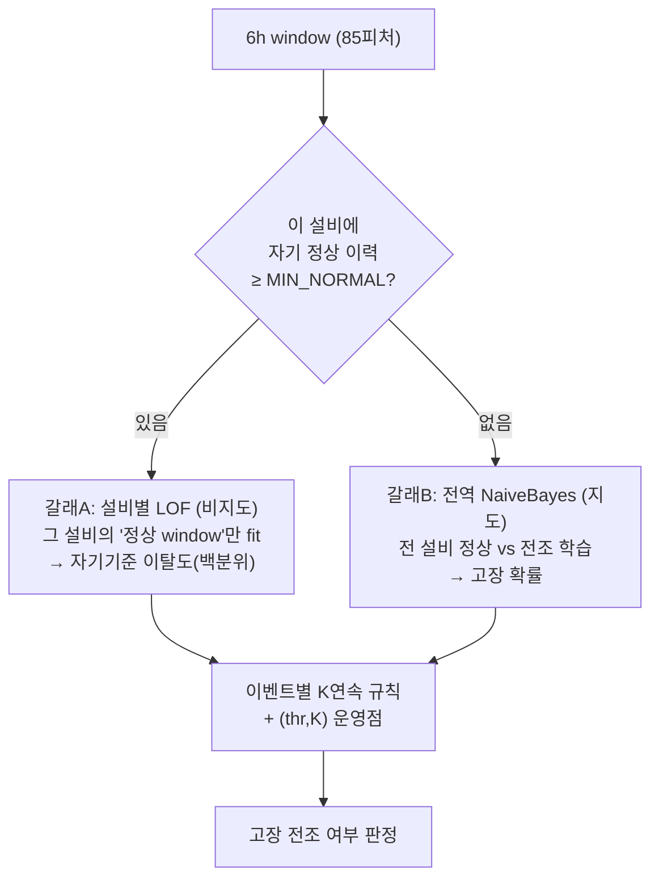

# 시스템 설계 근거 보고서 — 왜 이렇게 만들었나 (pipeline · M1)

## Overview

지역난방 고장 조기탐지 시스템의 **전처리·모델·라벨링 설계 선택마다 "왜"** 를 정리한다.
각 결정은 데이터 특성과 목표(선제 대응)에서 도출됐고, 대부분 실험/검증으로 뒷받침된다.

---

## 1. 전체 구조 (한눈에)

---

## 2. 왜 이렇게 전처리했나

| 전처리 선택 | 왜 (근거) |
|---|---|
| **10분 격자 리샘플** | 원본이 불규칙 10분 간격 → 일정 격자로 맞춰야 window·통계가 일관됨 |
| **공통 컬럼 자동탐색** | 설비마다 센서 구성이 다름(11~25개) → 전 설비 공통만 써야 일괄 처리 가능 |
| **누적→증분(diff)** | 에너지·유량은 누적값 → 그대로 쓰면 무의미. 10분 사용량(증분)이 실제 신호. 음수는 계량기 reset이므로 NaN |
| **6시간 window** | 고장은 특정 순간이 아니라 서서히 진행 → 6h 구간의 통계(평균·변동성·추세)가 전조를 담음 |
| **파생변수 dev·dT** | 절대 온도만으론 정상/고장 구분 불가. **추종편차(실측−목표), 온도차(공급−환수)** 가 "제어가 잘 되는가"를 직접 보여줌 → 검증서 `dev_std`가 고장전조에서 2배 |
| **DHW(온수) 추가** | 온수 고장(no DHW)은 난방 센서에 안 보임 → 온수 센서가 새 신호. **검증: 탐지율 0.25→0.50** |

---

## 3. 왜 "정상 vs 고장"이 아니라 "정상 vs 고장 **전조**"인가

| 질문 | 답 (근거) |
|---|---|
| 왜 '고장' 순간이 아니라 '전조'? | **목표가 선제(先制) 대응**이기 때문. 고장이 터진 순간을 맞히면 이미 늦음. 터지기 **전** 구간을 잡아야 미리 조치 가능 |
| 전조 구간을 어떻게 정의? | **B방법**: 끝점 = 신고일(Report date), 시작점 = 실제 이상 발단(없으면 신고일−N일), 최대 7일 |
| 왜 이진 분류? | 운영 판단이 "대응할까/말까"의 이분법 → normal vs pre_fault 이진이 실용적 |
| 정상은 어디서? | **normal_events.csv에서만** (정상 오염 방지). task·activity·미라벨 fault를 정상으로 쓰면 모델이 오염됨 |

---

## 4. 왜 이 모델(NaiveBayes)을 썼나

| 왜 NaiveBayes | 근거 |
|---|---|
| **소표본에 강건** | 독립 고장 28건뿐 → 파라미터 적은 단순 모델이 과적합 없이 유리. 부스팅·신경망은 검증서 과적합 확인 |
| **피처 독립 가정 적중** | 온수(DHW)·난방(hc1)이 물리적으로 분리 → NaiveBayes의 독립 가정이 이 데이터에선 오히려 맞음 |
| **검증 통과** | 16모델 nested CV 비교 → NaiveBayes만 0.50 달성 (in-sample 아닌 **검증된 값**) |
| 다른 모델은? | XGBoost=오경보 최저(정밀), LogReg=해석 최고 → **운영 목적별 대안**으로 문서화 |

> ※ **전역(global) 모델 조합**(캐스케이드·앙상블·비지도+지도 혼합·추가피처)은 검증서 모두 과적합/무효
> → "전역 모델 트릭은 허상, 진짜 새 신호(DHW)만 실효"가 확정됨.
> ★ **단, '설비별 자기기준' 이상탐지 하이브리드는 예외로 실효**가 검증됨 → §8 참조 (전역→설비별 관점 전환).

---

## 5. 왜 판정을 2단계로 나눴나

| 왜 2단계 | 근거 |
|---|---|
| 판정1만으론 부족 | "고장 전조"만 알면 언제 대응할지 모름. **얼마나 일찍 잡혔나(리드타임)** 가 있어야 선제/즉시/사후를 나눔 |
| 왜 efd 라벨 예측을 안 썼나 | efd=False가 **4건뿐** → 학습 불가(설비 암기만 됨). 대신 **시계열에서 실제 리드타임 측정**이 정확하고 데이터 문제 없음 |
| 결과 | 조기탐지 가능 7 / 임박 6 / 미탐 15 (미탐=센서 무신호 구조적 한계) |

---

## 6. 한계 (설계가 못 넘는 것)

- 표본 28건 → ±1~2건 노이즈. 검증(nested CV)으로 방향은 신뢰.
- **미탐 15건의 상당수는 제어 파라미터 오설정** = 센서에 원천적으로 안 보임 → ML로 불가. **설정 변경 로그** 등 새 데이터가 유일한 길.

---

## 7. 데이터 정보 (피처 수·구성)

### 7-1. 데이터셋별 규모
| 데이터셋 | 행(window) | 전체 칼럼 | 피처 | 정상 | 고장전조 | 비율(전조) |
|---|---:|---:|---:|---:|---:|---:|
| `m1_windows_3d` | 1,270 | 63 | 55 | 980 | 290 | 22.8% |
| `m1_windows_5d` | 1,382 | 63 | 55 | 980 | 402 | 29.1% |
| `m1_windows_7d` (MVP) | 1,494 | 63 | 55 | 980 | 514 | 34.4% |
| `m1_windows_7d_dhw` (채택) | 1,494 | 93 | **85** | 980 | 514 | 34.4% |
| `m1_windows_7d_rich` (실험) | 1,494 | 123 | 115 | 980 | 514 | 34.4% |

- **칼럼 = 메타 8 + 피처**. 메타 8 = substation_id, window_start, window_end, label, horizon_version, time_bucket, event_id, coverage.
- horizon(3/5/7)은 전조 window 수만 바뀜(290→514), 정상은 980 고정.

### 7-2. 피처 구성 = 변수 × 통계 5종
피처 = **변수 개수 × 5통계**(mean/std/min/max/slope).

| 데이터셋 | 변수 | × 통계 | = 피처 |
|---|---:|---:|---:|
| MVP (난방·에너지) | 11 | 5 | 55 |
| + DHW (온수) | 11 + **6** = 17 | 5 | 85 |
| + rich (추가센서) | 17 + 6 = 23 | 5 | 115 |

**MVP 11개 변수**: `outdoor_temperature`, `s_hc1_supply_temperature`,
`s_hc1_supply_temperature_setpoint`, `p_hc1_return_temperature`, `p_net_supply_temperature`,
`p_net_meter_heat_power`, `p_net_meter_flow`, `energy_diff`, `volume_diff`, **`dev`**, **`dT`**
(원본 7 + 증분 2 + 파생 2).

**DHW 추가 6개 변수**: `s_dhw_supply_temperature`, `s_dhw_supply_temperature_setpoint`,
`s_dhw_upper_storage_temperature`, `s_dhw_lower_storage_temperature`, **`dhw_dev`**, **`dhw_strat`**
(온수 4 + 파생 2).

> ★ 채택 모델은 **7d_dhw (85피처)**. MVP 55 → DHW 85로 늘린 것이 탐지율 0.25→0.50의 핵심.

### 7-3. 이벤트·라벨 원천 (M1)
| 항목 | 수 |
|---|---:|
| 전체 이벤트(disturbances) | 165 (fault 67 / task 43 / activity 55) |
| 정식 라벨 고장(faults.csv) | 33 |
| └ 학습 사용(efd=True) | **29** |
| └ 제외(efd=False) | 4 |
| 정상 이벤트(normal_events) | 35 |
| **학습 코어 이벤트** | 정상 35 + 고장 29 = **64** |
| 라벨 구간이 잡힌 설비 | 31 / 35 |

### 7-4. 결측·품질
- 피처 평균 결측률: MVP 1.4~1.6%, DHW ~29%(온수 없는 설비 10개분, imputation 처리).
- window coverage 최소 0.97 (6h 중 데이터 거의 꽉 참).
- 시간 누수 0 / 정상 오염 0 (감사 통과).

---

## 8. 후속 발견 — 설비별 이상탐지 하이브리드 (성능 갱신)

§4는 "전역 모델 조합은 전부 무효"였다. 그러나 **관점을 '전역'에서 '설비별 자기기준'으로**
바꾸자, 처음으로 NaiveBayes 단독(0.50)을 넘는 학습 구조가 나왔다.

### 8-1. 왜 '설비별'인가
전역 이상탐지는 35개 설비를 뭉쳐 정상 기준을 하나만 만든다. 그러면 특성이 다른 **건강한 설비**까지 이상으로 찍혀 오경보가 폭증하는데, 실제로 전역 OneClassSVM은 오경보가 0.49까지 치솟았다. 반면 각 설비를 **자기 자신의 정상 분포 대비 백분위**로 채점하면 설비 간 차이가 상쇄되므로, 이 함정을 피할 수 있다.

### 8-2. 학습 구조 (2-갈래 라우팅)

| 갈래 | 방식 | 학습 데이터 | 무엇을 배우나 | 담당 |
|---|---|---|---|---|
| **A. 설비별 LOF** | 비지도(원클래스) | **각 설비 자기 정상 window** | "이 설비의 평소 모습"에서 벗어난 정도 | 자기 정상 이력 있는 고장 **14/28** |
| **B. 전역 NaiveBayes** | 지도 | 전 설비 정상 vs 전조 라벨 | "무엇이 고장다운가"(전역 패턴) | 나머지 고장 **14/28** (폴백) |

라우팅은 '자기 정상 이력이 있는가'라는 **데이터 가용성**만으로 결정하며 고장 결과는 보지 않으므로, **라벨 누수가 없다.** 또한 정상 이벤트 35건은 모두 자기 이력을 갖고 있어 오경보는 전부 갈래A(자기기준)가 산정하는데, 이 덕분에 오경보가 낮게 유지된다.

### 8-3. 정직한 검증 여정 (누수 착시 → 교정) ★
이 결과는 성과 자체보다 **검증 과정에서 배운 것**이 더 큰 교훈이다. 오경보 숫자는 세 단계를 거치며 바뀌었다.

| 단계 | 오경보 | 무슨 일 |
|---|---:|---|
| 1차 측정 | 0.057 | 설비 내부 정상 CV를 `shuffle` → **인접 window가 새어듦(누수 착시)** |
| 누수 교정 | 0.257 | **시간 순서 블록 분할**로 바꾸니 오경보 급등 → 0.057은 가짜였음 확인 |
| 운영점 최적화 | **0.114** | 갈래A 오경보 목표를 조이자 **탐지율(0.679) 그대로**인 채 오경보만 하락 |

임계값을 조여도 탐지율이 떨어지지 않았다는 것은, 설비별 이상신호가 그만큼 **선명**해서 판정 경계에 아슬아슬하게 걸려 있지 않다는 뜻이다. 게다가 프론티어 전 구간(cap 0.05~0.20)에서 한결같이 NB를 넘으면서 오경보 예산 안에 들어왔으므로, 이 성과는 **특정 설정에서 우연히 나온 요행이 아니다.**

### 8-4. 결과 (nested CV · 시간블록 · 정직)
| 방법 | 탐지율 | 오경보 |
|---|---:|---:|
| **하이브리드 (설비별 LOF + NB 폴백)** | **0.679 (19/28)** | **0.114 (4/35)** |
| NaiveBayes 단독(기존 최고) | 0.500 (14/28) | 0.171 (6/35) |

갈래별로 보면 설비별 LOF가 자기 담당 14건 중 12건을, NB 폴백이 나머지 14건 중 7건을 잡아 합계 19건이 되고, 오경보는 6건에서 4건으로 줄었다. 탐지와 오경보를 **양쪽 모두** 0.2 예산 안에서 개선했으므로, 그동안 넘지 못하던 NB의 천장을 처음으로 돌파한 셈이다.

### 8-5. 한계 (정직)
설비별 갈래는 **자기 정상 이력이 있는 설비(14/28)만** 담당할 수 있어, 나머지 절반은 여전히 NB 폴백에 의존한다. 또 표본이 28/35건으로 작아 ±1~2건의 노이즈가 있고, 시간블록 CV로도 **블록 경계에 인접한 window**까지 완전히 걸러내지는 못한다. 관련 검증 스크립트는 `validate_anomaly_persub_dhw.py`, `validate_persub_matched_dhw.py`, `validate_hybrid_dhw.py`, `validate_hybrid_frontier_dhw.py` (pipeline/)에 있다.

> 핵심 통찰: **같은 데이터라도 "설비마다 자기 자신과 비교"하게 하면 새 정보가 생긴다.**
> §4의 "새 신호(DHW)만 실효" 명제를 보완 — **'관점(정규화 기준)의 전환'도 새 정보의 원천**이 될 수 있다.

---

## 9. 결론

- **모든 설계 선택은 데이터 특성 + 선제 대응 목표에서 도출**됐고, 검증으로 뒷받침됨.
- 전처리(격자·증분·window·파생), 라벨링(전조), 모델(NaiveBayes), 2단계 판정 각각의 "왜"가 일관됨.
- 기존 검증 성과: **고장유무 탐지율 0.50 @ 오경보 0.17 + 조기탐지 가능 7건(최대 6.2일 리드)**.
- **갱신 성과(§8): 설비별 이상탐지 하이브리드 = 탐지율 0.68 @ 오경보 0.11** (양쪽 개선, 정직 검증).
- 남은 한계는 모델이 아니라 **데이터(센서 밖 신호)** 의 문제로 명확히 규정됨.
- 방법론 교훈: **전역 모델 트릭은 허상이지만, '설비별 자기기준'이라는 관점 전환은 실효**.
