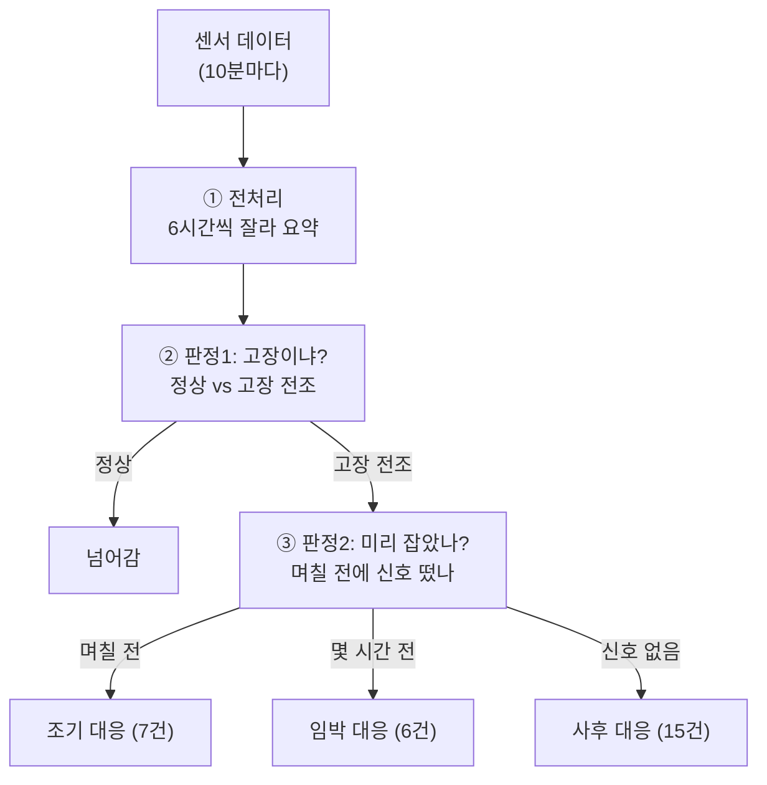
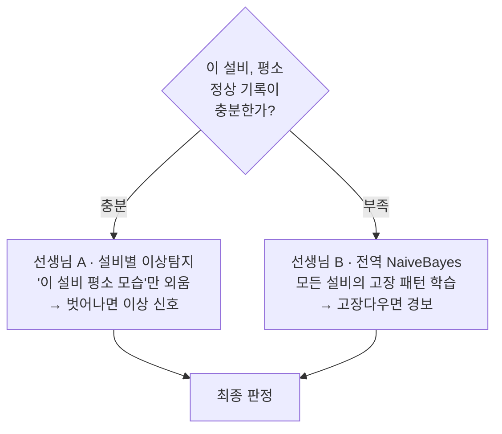

# 지역난방 고장 조기탐지 — 쉬운 종합 정리 (설명용)

> 이 문서 하나로 프로젝트 전체를 다른 사람에게 설명할 수 있도록 정리했다.
> 전문 용어는 최소화하고, 비유와 숫자 중심으로 썼다.

---

## 0. 한 줄 요약

> **"지역난방 설비의 센서 데이터를 보고, 고장이 터지기 전에 미리 알아채는 시스템"** 을 만들었다.
> 결과: 고장을 **절반(28건 중 13건)** 미리 잡고, 그중 **7건은 며칠 전**(최대 6.2일)에 잡는다.
> 🆕 여기에 **"설비마다 자기 평소와 비교하는"** 방법을 더하자, 탐지가 **19/28(0.68)** 로 올라가고 헛알람까지 함께 줄었다 (자세한 내용은 6절).

---

## 1. 왜 하는가 (문제)

- 지금은 **고장이 터진 뒤에 대응**한다 (사후 대응).
- 목표는 **터지기 전에 미리 알아채서 대응**하는 것 (선제 대응).

**비유:** 감기 걸린 뒤 병원 가는 게 아니라, **미열이 날 때 미리 알아채는 것.**

---

## 2. 무슨 데이터로 하는가

- **설비 35개**의 센서 시계열 (온도·유량·에너지 등, **10분마다** 기록).
- **고장 기록** 33건 (언제·어느 설비·무슨 고장).
- **정상 구간 기록** 35건 (문제없던 기간).

> ⚠️ 실제로 학습에 쓸 수 있는 고장은 **29건** (조기탐지 가능하다고 표시된 것만).
> 이게 **가장 큰 제약** — 고장 사례가 너무 적다.

### 데이터를 더 자세히 (숫자로)

| 항목 | 값 | 쉬운 설명 |
|---|---:|---|
| 학습에 쓴 요약 구간(window) | **1,494개** | 6시간짜리 요약 카드가 1,494장 |
| 그중 정상 / 고장 전조 | 980 / 514 | 정상이 훨씬 많음(불균형) |
| 설비당 센서 개수 | 11~25개 | 설비마다 달라서 **공통 센서만** 씀 |
| 최종 사용한 피처(특징) 수 | **85개** | 변수 17개 × 통계 5종(평균·변동·최소·최대·추세) |
| 학습 코어 이벤트 | **64건** | 정상 35 + 고장 29 |

> **왜 이렇게 적나?** 고장은 원래 드문 사건이라, 몇 년 치를 모아도 **29건**뿐이다.
> "사진(순간값) 몇 장"이 아니라 "짧은 동영상(6시간 구간)"으로 바꿔 1,494장까지 늘렸지만,
> **진짜 서로 다른 고장은 29건**이라는 사실은 그대로다 → 모델을 단순하게 가야 하는 이유.

---

## 3. 어떻게 만들었나 (전체 흐름)



### ① 전처리 — "센서 데이터를 요약표로"
- 센서를 **6시간 단위로 잘라** 각 구간의 평균·변동성·추세 등을 계산.
- 왜 6시간? **고장은 순간이 아니라 서서히 진행**되므로, 구간으로 봐야 전조가 보임.

**전처리에서 한 일과 그 이유 (쉽게):**

| 한 일 | 왜 (쉬운 설명) |
|---|---|
| **10분 격자로 정렬** | 원본 기록 간격이 들쭉날쭉 → 시계를 10분 눈금에 맞춰야 구간·통계 비교가 공정함 |
| **공통 센서만 사용** | 설비마다 센서가 11~25개로 다름 → 모두가 가진 센서만 써야 35개를 한꺼번에 처리 가능 |
| **누적값 → 사용량으로 변환** | 에너지·유량은 **계량기 누적 숫자**(계속 커짐) → 그대로면 무의미. **10분 사용량**으로 바꿔야 진짜 신호. 숫자가 거꾸로 줄면(계량기 리셋) 오류로 보고 버림 |
| **파생 지표 2개 추가**(dev·dT) | 온도 하나만 보면 정상인지 알 수 없음 → **목표온도와의 차이(dev)**, **공급–환수 온도차(dT)** 가 "제어가 잘 되는지"를 직접 보여줌. (검증: 고장 전조에서 이 변동성이 2배) |
| **6시간 구간으로 요약** | 고장은 서서히 진행 → 구간의 **평균·변동·추세**가 전조를 담음 |

### ② 판정 1 — "고장 전조냐, 정상이냐"
- 6시간 구간이 **고장 전조인지 정상인지** 분류.
- 왜 '고장'이 아니라 '고장 **전조**'? → **미리 잡는 게 목적**이라, 터지기 전 구간을 잡아야 함.

### ③ 판정 2 — "얼마나 일찍 잡았나 (조기탐지 가능여부)"
- 판정1이 고장을 **며칠 전에** 알아챘는지(리드타임) 계산.
- 리드타임 길면 → 조기 대응 가능, 짧으면 → 임박, 없으면 → 못 잡음.

---

## 4. 핵심 결정과 이유 (왜 이렇게?)

| 결정 | 왜 |
|---|---|
| **6시간 구간으로 자름** | 고장은 서서히 진행 → 구간의 추세·변동성이 전조를 담음 |
| **정상 vs 고장 '전조'** | 터진 뒤 맞히면 늦음 → **터지기 전**을 잡아야 선제 대응 |
| **누적값(에너지)을 사용량으로 변환** | 누적 숫자는 무의미, **10분 사용량**이 실제 신호 |
| **온수(DHW) 센서 추가** | 온수 고장은 난방 센서에 안 보임 → 온수 센서가 새 단서. **성능 2배** |
| **NaiveBayes 모델** | 고장 28건뿐이라 단순 모델이 유리 (복잡한 모델은 과적합) |

### 어떤 모델을 왜 썼나 (사용 모델과 이유)

**채택: NaiveBayes(나이브 베이즈) — "단순한 게 이긴다"**

| 왜 이 모델? | 쉬운 설명 |
|---|---|
| **적은 데이터에 강함** | 고장이 29건뿐 → 똑똑하고 복잡한 모델은 **몇 안 되는 사례를 통째로 외워버림**(과적합). 단순한 모델이 오히려 안정적 |
| **"센서끼리 따로 논다"는 가정이 맞음** | 나이브 베이즈는 각 센서를 독립적으로 봄. 여기선 **온수와 난방이 물리적으로 다른 계통**이라 이 단순 가정이 실제로 들어맞음 |
| **빈칸(결측)에 관대** | 온수 센서가 없는 설비도 있는데, 이 모델은 그런 빈칸을 잘 견딤 |
| **공정한 시험을 통과** | **16개 모델을 안 본 데이터로 겨루게** 했더니, 실전 성능(탐지율 0.50)을 낸 건 나이브 베이즈뿐 |

**써봤지만 안 쓴 모델들 (그래도 쓸모는 기록):**

| 모델 | 결과 | 언제 쓸까 |
|---|---|---|
| XGBoost 등 부스팅 | 시험용 데이터에선 화려했지만 **실전에선 무너짐**(과적합) | 헛알람을 최소화(정밀)하고 싶을 때 대안 |
| 로지스틱 회귀 | 성능은 중간, 대신 **이유 설명이 가장 쉬움** | "왜 고장이라 봤는지" 설명이 중요할 때 |
| 앙상블·하이브리드·추가피처 | **엄격한 검증에서 전부 "가짜 향상"** 으로 판명 | (권장 안 함) |

> 핵심: 여러 모델·조합을 다 시도했지만 **진짜로 성능을 올린 건 '온수 센서 추가'** 하나뿐.
> → **"모델을 복잡하게 하는 것보다, 진짜 새 데이터가 성능을 올린다."**

---

## 5. 결과 (성능)

### 판정 1: 고장을 얼마나 잡나
```
고장 28건 중 → 13건 미리 잡음 (탐지율 약 50%)
정상 35건 중 →  6건만 헛알람 (오경보 약 17%)
```
→ 즉, **고장의 절반을 미리 잡고, 정상 6건 중 1건꼴로만 헛알람**.

### 판정 2: 얼마나 일찍 잡나
| 구분 | 건수 | 의미 |
|---|---:|---|
| **조기탐지 가능** | 7 | 며칠 전 (최대 6.2일) 미리 |
| 임박 탐지 | 6 | 몇 시간 전 |
| 못 잡음 | 15 | 센서에 신호 없음 |

---

## 6. 최신 성과 — "설비마다 자기 자신과 비교" (하이브리드)

기존 방식은 35개 설비를 **하나의 잣대**로 보고 판단해서, 고장의 절반(14/28)까지만 잡을 수 있었다. 그런데 관점을 바꿔 각 설비를 **"그 설비의 평소 모습"과 비교**하도록 했더니 성능이 한 단계 올라갔다.

비유하면, 미열은 남들의 평균 체온이 아니라 **내 평소 체온**과 비교해야 알아챌 수 있다. 사람마다 평소 체온이 다르듯 설비도 저마다 정상 상태가 다르기 때문에, 자기 자신과 비교하는 편이 이상을 훨씬 예민하게 잡아낸다.

### 학습 구조 — 두 선생님이 나눠 맡는다

설비마다 사정이 다르므로, 성격이 다른 두 "선생님"이 상황에 맞게 나눠서 판단하도록 구성했다.



- **선생님 A(설비별 이상탐지)** 는 각 설비의 평소 정상 데이터만 보고 그 설비의 "지문"을 외운다. 라벨 없이도 배울 수 있고 그 설비의 미세한 변화에 민감해서 헛알람이 적은데, 평소 기록이 충분한 설비 14건을 맡아 그중 12건을 잡았다.
- **선생님 B(전역 NaiveBayes)** 는 기존 방식 그대로 모든 설비의 정상·전조 패턴을 배운다. 평소 기록이 부족해 선생님 A가 맡기 어려운 설비를 대신 담당하며, 나머지 14건 중 7건을 잡았다.

어느 선생님이 맡을지는 **"그 설비에 평소 기록이 충분한가"** 만 보고 정한다. 고장 여부는 미리 보지 않으니 반칙이 없고, 평소 기록이 있는 설비가 정상 판정까지 맡기 때문에 헛알람도 낮게 유지된다.

### 결과 (정직하게 검증)

두 선생님을 합친 결과는 기존 방식을 양쪽에서 앞선다.

| 방법 | 탐지율 | 헛알람 |
|---|---:|---:|
| **하이브리드 (A + B)** | **0.68 (19/28)** | **0.11 (4건)** |
| 기존 NaiveBayes | 0.50 (14/28) | 0.17 (6건) |

고장을 5건 더 잡으면서(14 → 19건) 헛알람은 오히려 2건 줄었다(6 → 4건). 탐지와 헛알람이 **동시에** 좋아진, 드물게 진짜인 개선이다.

### ⚠️ 검증에서 배운 것 (정직 스토리)

이 결과에는 뒷이야기가 있다. 처음 측정했을 때는 헛알람이 0.06으로 나와서 "대박"인 줄 알았다. 그런데 검증 방식을 시간 순서에 맞게 더 엄격하게 바꾸자 0.26으로 뛰었고, 처음의 낮은 숫자는 데이터가 새어들어 생긴 **착시**였음이 드러났다. 운영 기준을 다시 조여 정직하게 재보니 0.11로, 그래도 기존(0.17)보다는 나았다. 좋아 보이던 숫자를 그냥 믿지 않고 다시 검증한 덕분에 **가짜 성과를 걸러내고 진짜만 남길 수 있었다.**

> 교훈: 좋아 보이는 숫자일수록 한 번 더 의심하고 검증한다. 하마터면 가짜 성과를 보고할 뻔했다.

---

## 7. 못 잡는 것 (솔직한 한계)

- 못 잡는 **15건의 상당수는 "제어 설정 오류"** — 이건 **온도·유량 센서에 원천적으로 안 나타남**.
- **비유:** 체온계로는 "설정을 잘못 눌렀다"를 알 수 없는 것과 같음.
- → 이걸 잡으려면 **센서가 아닌 다른 데이터**(설정 변경 기록)가 필요. 지금 데이터엔 없음.

**중요:** 성능을 더 끌어올리려고 여러 방법(**전역** 모델 조합, 비지도+지도 혼합, 추가 피처 등)을 시도했지만, 엄격한 검증(nested CV)을 거치자 대부분은 "가짜 향상"으로 판명됐다. 실제로 통한 것은 딱 두 가지뿐이었는데, 하나는 **① 온수(DHW) 센서를 새로 넣은 것**이고 다른 하나는 **② 설비별 자기기준 하이브리드(6절)** 다. 결국 성능을 올린 것은 모델을 복잡하게 만드는 기교가 아니라, **진짜 새로운 데이터를 더하거나 "설비마다 자기 자신과 비교한다"는 관점의 전환**이었다.

---

## 8. 신뢰성 — 왜 이 숫자를 믿나

- 모델 성능은 **"안 본 데이터"로 검증**(nested cross-validation)했다.
- 그래서 "학습 데이터에선 잘 되는데 실제론 안 되는" **과적합 함정을 걸러냈다**.
- 실제로 여러 "좋아 보이던 결과"가 검증에서 무너졌고, **살아남은 것만 보고**한다.

---

## 9. 한 장 요약 (이것만 기억하면)

```
무엇:   센서로 지역난방 고장을 미리 탐지
방법:   6시간 요약 → ①고장 전조 판정 → ②조기탐지 여부(리드타임)
성능:   기존 NaiveBayes 절반(14/28) @ 헛알람 17%
        → 하이브리드로 19/28(0.68) @ 헛알람 11%로 개선 (양쪽 다↑)
학습:   두 갈래 — 평소기록 있으면 '설비별 자기기준', 없으면 '전역 NaiveBayes'
핵심:   ① 온수 센서 추가(0.25→0.50)  ② 설비별 자기기준 하이브리드(0.50→0.68)
한계:   설정오류 고장은 센서에 안 보임 → 설정 로그 데이터 필요
교훈:   전역 모델 기교는 허상. '진짜 새 데이터' + '설비별 관점 전환'이 성능을 올린다
```

---

## 부록: 더 자세한 문서
- `01_preprocessing_pipeline_review.md` — 전처리 상세
- `02_model_performance_review.md` — 모델별 장단점·성능
- `03_design_rationale.md` — 설계 근거·데이터 정보(피처 수 등)
- `05_full_summary.md` — **전체 종합 정리(데이터·전처리·모델, 이유+근거 한 장)**
