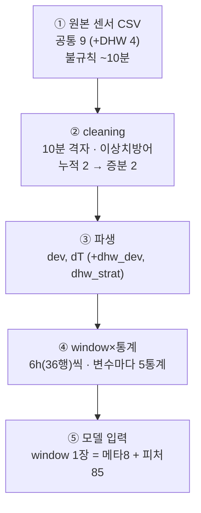
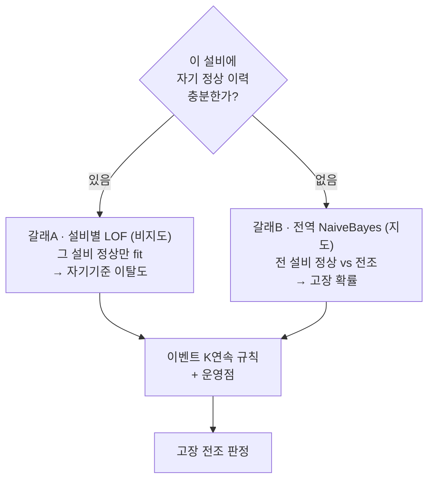

# 지역난방 고장 조기탐지 — 전체 종합 정리 (데이터·전처리·모델, 이유+근거)

> 데이터부터 전처리·모델학습까지 **"무엇을 · 왜 · 무슨 근거로"** 를 한 장에 모았다.
> 모든 성능 수치는 **설비단위 nested CV(안 본 데이터 검증)** 값이다. (M1 기준)

---

## 0. 한눈에 보기 (핵심 결론)

```
데이터:   설비 35개 센서(10분) + 고장 29건 + 정상 35건  ← 고장이 적음(최대 제약)
전처리:   센서 13개 → (증분·파생) 변수 17개 → (×통계5) 피처 85개 / window 1장(6h)
모델:     기존 NaiveBayes 0.50 @ 오경보 0.17
          → 설비별 이상탐지 하이브리드 0.68 @ 0.11 (양쪽 개선, 정직 검증)
교훈:     "모델 기교"는 대부분 허상. 진짜 효과는 ①새 신호(온수센서) ②관점전환(설비별 자기기준)
```

| 단계 | 최종 선택 | 한 줄 이유 | 핵심 근거(수치) |
|---|---|---|---|
| 데이터 | efd=True 고장 29 + 정상 35 | 오염 없는 라벨만 사용 | 정상은 normal_events에서만 → 오염 0 |
| 전처리 | 85피처(변수 17 × 통계 5) | 소표본엔 슬림 피처가 유리 | 리치 115피처는 오경보만↑(§3) |
| 모델(기존) | NaiveBayes | 소표본·피처독립에 강함 | 16모델 nested CV서 유일하게 0.50 |
| 모델(갱신) | 설비별 LOF + NB 하이브리드 | 설비마다 자기기준으로 비교 | 0.68 @ 0.11 (NB 0.50@0.17 대비 양쪽↑) |
| 리드타임 | 시계열 직접 측정 | 분류는 데이터 부족 | efd=False 4건뿐 → 분류 불가 |

---

## 1. 데이터 — 무엇을, 왜 이렇게 골랐나

| 항목 | 값 | 왜 / 근거 |
|---|---:|---|
| 설비 | 35개 | 제조사 M1 전체 |
| 센서 시계열 | 10분 간격 | 원본 기록 주기 |
| 고장 기록 | 33건 → **학습 29건** | efd=True(조기탐지 가능표시)만 사용, efd=False 4건 제외 |
| 정상 이벤트 | 35건 | **normal_events.csv에서만** → 정상 오염 방지 |
| 학습 window | **1,494장** (정상 980 / 전조 514) | 6시간 구간으로 잘라 표본 확대 |
| 라벨 구간 잡힌 설비 | 31 / 35 | 나머지는 이벤트 매칭 실패 |

**⚠️ 최대 제약:** 진짜로 서로 다른 고장은 **29건**뿐. window로 1,494장까지 늘려도 이 사실은 그대로다.
→ **모델을 단순하게 가야 하는 근본 이유**(복잡한 모델은 29건을 통째로 외워버림 = 과적합).

**왜 '고장'이 아니라 '고장 전조(pre_fault)'?** 목표가 선제 대응이라, 터진 순간이 아니라 **터지기 전 구간**을 학습 타깃으로 삼아야 한다(끝점=신고일, 시작점=실제 발단, 최대 7일).

---

## 2. 전처리 — 피처가 어떻게 변하나 (+ 각 단계 이유)

### 2-1. 변환 흐름



### 2-2. 개수 변화 (DHW 버전)

| 단계 | 무슨 일 | 변수 수 | 형태 |
|---|---|---:|---|
| ① 원본 | 공통센서 9 + DHW 4 | 13 센서 | 시계열 |
| ② cleaning | 누적 2개 → 증분 2개로 교체 | 9 (+DHW 4 = 13) | 시계열 |
| ③ 파생 | dev·dT (+dhw 2) 추가 | 11 (+DHW 6 = **17**) | 시계열 |
| ④ window×통계5 | mean·std·min·max·slope | 17 × 5 = **85** | **1행/window** |
| ⑤ 모델 | X=85피처, y=라벨 | **85 피처** | 1494 × 85 표 |

> **핵심 배율:** ④에서 **변수 1개 → 피처 5개**. `17 × 5 = 85`.

### 2-3. 각 전처리 선택의 이유+근거

| 선택 | 왜 | 근거 |
|---|---|---|
| **10분 격자 리샘플** | 원본 간격이 들쭉날쭉 | 격자에 맞춰야 window·통계가 일관됨 |
| **공통 센서만** | 설비마다 센서 11~25개로 다름 | 공통만 써야 35개 일괄 처리 |
| **누적 → 증분(diff)** | 에너지·유량은 누적값이라 무의미 | 10분 사용량이 실제 신호. 역행(reset)은 NaN |
| **파생 dev·dT** | 절대 온도만으론 정상/고장 구분 불가 | 검증: 전조에서 `dev` 변동성 2배 |
| **6시간 window** | 고장은 순간 아닌 '구간' 현상 | 구간의 추세·변동성이 전조를 담음 |
| **통계 5종** | 평균만으론 부족 | 변동성·추세까지 봐야 전조 포착 |
| **온수(DHW) 센서 추가** | 온수 고장은 난방센서에 안 보임 | 검증: 탐지 0.25 → **0.50** (2배) |

### 2-4. ★ 피처는 '많이'가 아니라 '알맞게' — 리치 vs lean

같은 검증으로 초기 리치(115피처)와 파이프라인 lean(85피처)를 비교한 결과:

| 모델 | 초기 리치(115) | 파이프라인 lean(85) | 승자 |
|---|---|---|---|
| 하이브리드(채택) | 0.679 @ 0.314 | 0.679 @ **0.257** | ✅ lean |
| NaiveBayes | 0.500 @ 0.229 | 0.500 @ **0.171** | ✅ lean |
| IsolationForest | 0.393 @ 0.314 | 0.286 @ **0.143** | ✅ lean |

→ **여분의 피처는 신호가 아니라 잡음** → 오경보만 늘림(특히 이상탐지는 차원의 저주에 취약).
**결론: 피처를 85개로 슬림화한 파이프라인 전처리가 더 잘 됨.** (근거: `modeling/artifacts/anomaly_on_original.csv`)

---

## 3. 모델학습 — 무엇을 왜 썼나

### 3-1. 왜 NaiveBayes였나 (기존 최고)

| 이유 | 근거 |
|---|---|
| 소표본에 강함 | 고장 29건 → 파라미터 적은 단순 모델이 과적합 없음 |
| '피처 독립' 가정이 맞음 | 온수·난방이 물리적으로 독립 계통 → 가정 적중 |
| 결측에 관대 | 온수 없는 설비 결측을 잘 견딤 |
| 검증 통과 | 16모델 nested CV서 **유일하게 0.50** 달성 |

### 3-2. 이번에 시도한 조합/방법 전부 (정직 검증 성적표)

> 성능을 더 올리려 **여러 방향을 실험**했다. 대부분은 NB(0.50)를 못 넘었고, 딱 하나가 넘었다.

| # | 시도 | 결과 | 판정 |
|---|---|---|---|
| ① | NB + 다른 지도모델 (soft/AND) | 최선 0.500 (오경보만↑) | ❌ 못 넘음 |
| ② | NB 제외 지도 조합 | 최고 0.250 | ❌ 폭락 |
| ③ | 전역 이상탐지 (IF/LOF/OCSVM) | IF 0.286@0.14 / LOF·OCSVM 오경보 0.3~0.5 | ❌ 열세 |
| ④ | 비지도 + 지도 혼합 | 최선 0.500@0.20 | ❌ 못 넘음 |
| ⑤ | **설비별 이상탐지 + NB 하이브리드** | **0.679 @ 0.114** | ✅ **돌파** |

근거 파일: `pipeline/artifacts/validate_*.csv` (soft_ensemble / anomaly / mixed / hybrid_frontier 등)

### 3-3. ★ 돌파구 — 설비별 자기기준 하이브리드

**아이디어:** 모든 설비를 한 잣대로 보지 말고, **각 설비를 "그 설비의 평소"와 비교**.
(비유: 미열은 남 평균이 아니라 **내 평소 체온**과 비교해야 안다.)

**학습 구조 (2-갈래 라우팅):**



| 갈래 | 방식 | 학습 데이터 | 담당 |
|---|---|---|---|
| A. 설비별 LOF | 비지도 | 각 설비 자기 정상 | 이력 있는 고장 14 → **12 탐지** |
| B. 전역 NaiveBayes | 지도 | 전 설비 정상/전조 | 나머지 14 → **7 탐지** |

- **라우팅은 라벨 누수 없음**: '자기 정상 이력 유무'(데이터 가용성)로만 배정.
- **결과: 0.679(19/28) @ 오경보 0.114(4/35)** — NB(0.50@0.17) 대비 탐지·오경보 양쪽 개선.

### 3-4. ★ 정직성 — 가짜 성과를 걸러낸 과정

| 단계 | 오경보 | 무슨 일 |
|---|---:|---|
| 1차 | 0.057 | 정상 CV를 shuffle → 인접 window 누수(착시) |
| 교정 | 0.257 | 시간순서 블록 분할 → 착시 확인 |
| 최적화 | **0.114** | 운영점 조이자 탐지(0.679) 유지한 채 오경보만↓ |

> **교훈: 좋아 보이는 숫자일수록 다시 검증한다.** 하마터면 가짜(0.057)를 보고할 뻔했다.

### 3-5. 리드타임(판정2)은 왜 '측정'인가

- efd=False가 **4건뿐** → 분류 모델로 학습하면 설비 암기만 됨.
- 그래서 분류 대신 **시계열에서 실제 리드타임을 직접 측정** → 조기 7 / 임박 6 / 미탐 15.

---

## 4. 검증 방법 — 왜 이 숫자를 믿나

| 장치 | 무엇을 막나 |
|---|---|
| 설비단위 GroupKFold | 같은 설비가 학습·평가에 동시에 들어가는 누수 |
| 이벤트 K연속 규칙 | 단발 스파이크 오탐 |
| 오경보 ≤ 0.2 제약 | 운영 불가능한 고오경보 운영점 |
| 시간순서 블록 정상 CV | 인접 window 시간 누수 |
| 안쪽/바깥 분리(nested) | 하이퍼파라미터를 test로 고르는 낙관 |

→ 실제로 여러 "좋아 보이던 결과"가 이 장치들에서 무너졌고, **살아남은 것만 보고**했다.

---

## 5. 한계 (정직)

- 고장 표본 29/28건 → ±1~2건 노이즈. 방향은 nested CV로 신뢰.
- 설비별 갈래는 **자기 정상 이력 있는 절반(14/28)만** 담당 → 나머지는 NB 폴백.
- 미탐 상당수는 **제어 파라미터 오설정** = 센서에 원천적으로 안 보임 → **설정 변경 로그** 등 센서 밖 데이터가 유일한 길.

---

## 6. 최종 결론

1. **데이터 특성(소표본)이 모든 선택을 지배** — 단순 모델·슬림 피처가 정답.
2. **전처리:** 센서 13 → 변수 17 → 피처 85. 증분·파생·window·통계 각 단계에 이유가 일관.
3. **모델:** 전역 모델 기교(조합·부스팅·많은 피처)는 대부분 허상.
   실효는 딱 둘 — **① 온수 센서(새 신호)**, **② 설비별 자기기준 하이브리드(관점 전환)**.
4. **성과:** 고장유무 **0.50 → 0.68**, 오경보 **0.17 → 0.11** (정직 검증) + 조기탐지 7건(최대 6.2일).

---

## 부록: 관련 문서·산출물

- `01_preprocessing_pipeline_review.md` — 전처리 상세
- `02_model_performance_review.md` — 모델별 성능
- `03_design_rationale.md` — 설계 근거(§7 데이터, §8 하이브리드)
- `04_easy_overview.md` — 쉬운 설명용
- 검증 스크립트: `pipeline/validate_*.py`, `modeling/anomaly_on_original.py`
- 결과 CSV: `pipeline/artifacts/`, `modeling/artifacts/`
