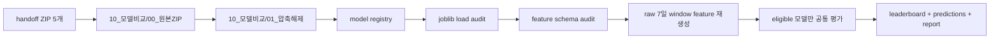

# 모델 handoff 공통 평가 리더보드 보고서

## 개요

모델 handoff ZIP 5개를 `10_모델비교` 아래에 모으고, 같은 공통 평가셋에서 실제 로딩과 예측이 가능한 모델만 `normal vs pre_event` 조기탐지 리더보드에 포함했다.

이번 비교는 모델 목적이 다른 산출물을 억지로 한 순위에 넣지 않기 위해 보수적으로 진행했다. `leadtime`, `priority`, `front_gate`, `task_gate`, `activity_gate`, 순수 anomaly 모델은 target이 달라 pre_event 성능 순위에서 제외했다. 또한 `ljy2`의 system-stratified pre_event 후보는 같은 `standard_feature_pool.csv` main 평가 row로 fit된 candidate라 in-sample 점수로 보고 순위에서 제외했다. 공통 CSV에 feature가 없더라도 raw 7일 window에서 feature 계약을 정확히 재생성할 수 있는 모델은 별도 adapter로 평가했다.

## 무엇을 했는지

| 항목 | 값 |
|---|---:|
| 평가 row | 112 |
| normal row | 65 |
| pre_event row | 47 |
| 발견 모델 수 | 18 |
| 로딩 성공 모델 수 | 18 |
| 리더보드 포함 모델 수 | 4 |

## 왜 이렇게 했는지

공통 리더보드는 같은 label, 같은 row, 같은 metric에서만 의미가 있다. 그래서 모든 모델을 같은 112개 row와 같은 `normal/pre_event` label로 평가했다. 필요한 feature가 공통 CSV에 없을 때는 원본 PreDist operational window에서 통계 feature를 다시 계산했고, 재생성 규칙이 없는 feature는 임의로 채우지 않고 제외했다.

## 변경 내용

- 원본 ZIP 복사본과 압축 해제본을 `10_모델비교` 아래에 구성했다.
- `standard_feature_pool.csv`를 공통 평가셋으로 복사하고 label 기준을 문서화했다.
- 모델 registry, 로딩 감사, feature schema 감사, adapter feature 재생성, prediction, leaderboard CSV를 생성했다.
- 재실행 가능한 노트북 `03_노트북/01_model_handoff_common_leaderboard.ipynb`를 생성했다.

## 리더보드 포함 모델

| owner | model_file | task_family | evaluation_basis | threshold | rows | balanced_accuracy | precision | recall | f1 | normal_fpr | tp | fp | fn | tn |
| --- | --- | --- | --- | --- | --- | --- | --- | --- | --- | --- | --- | --- | --- | --- |
| ljy2 | m1_m2_system_stratified_pre_event_candidate.joblib | early_detection | eligible_existing_common_dataset | 0.4000 | 112 | 0.9923 | 0.9792 | 1.0000 | 0.9895 | 0.0154 | 47 | 1 | 0 | 64 |
| hsj | 09_lightgbm_model.joblib | pre_event_candidate | eligible_regenerated_raw_7d_features | 0.5000 | 112 | 0.6025 | 0.4878 | 0.8511 | 0.6202 | 0.6462 | 40 | 42 | 7 | 23 |
| hsj | 07_random_forest_baseline.joblib | pre_event_candidate | eligible_regenerated_raw_7d_features | 0.5000 | 112 | 0.5740 | 0.4600 | 0.9787 | 0.6259 | 0.8308 | 46 | 54 | 1 | 11 |
| nyj | baseline_model.joblib | early_detection | eligible_regenerated_raw_7d_features | 0.7500 | 112 | 0.5354 | 0.5000 | 0.2553 | 0.3380 | 0.1846 | 12 | 12 | 35 | 53 |

## Front Gate 리더보드

Front gate는 `normal=0`, `fault=1` 기준의 별도 평가다. 평가 row는 90개이며, 이 표에는 target이 같은 `fault_gate` 모델만 포함했다. `pre_event`, `task_gate`, `activity_gate`는 점수가 계산 가능해도 목적이 달라 제외했다.

| owner | model_file | task_family | evaluation_basis | threshold | rows | balanced_accuracy | precision | recall | f1 | normal_fpr | tp | fp | fn | tn |
| --- | --- | --- | --- | --- | --- | --- | --- | --- | --- | --- | --- | --- | --- | --- |
| ljy | m1_fault_gate_rf_depth3.joblib | front_gate | eligible_locked_front_gate_oof_predictions | 0.5000 | 90 | 0.8455 | 0.8750 | 0.8909 | 0.8829 | 0.2000 | 49 | 7 | 6 | 28 |
| ljy2 | m1_fault_gate_rf_depth3.joblib | front_gate | eligible_locked_front_gate_oof_predictions | 0.5000 | 90 | 0.8455 | 0.8750 | 0.8909 | 0.8829 | 0.2000 | 49 | 7 | 6 | 28 |

## 제외 모델 요약

| owner | model_file | task_family | eligibility | reason | required_feature_count | missing_feature_count | missing_feature_examples |
| --- | --- | --- | --- | --- | --- | --- | --- |
| hsj | 08_isolation_forest.joblib | anomaly | excluded_task_family | target_mismatch:anomaly | 354 | 274 | feature_row_count; feature_sensor_count; outdoor_temperature.1__delta; outdoor_temperature.1__first; outdoor_temperature.1__last; outdoor_temperature.1__max; outdoor_temperature.1__mean; outdoor_temperature.1__min; outdoor_temperature.1__missing_rate; outdoor_temperature.1__slope; outdoor_temperature.1__std; outdoor_temperature__delta; outdoor_temperature__first; outdoor_temperature__last; outdoor_temperature__slope; p_dhw_control_valve_position__delta; p_dhw_control_valve_position__first; p_dhw_control_valve_position__last; p_dhw_control_valve_position__max; p_dhw_control_valve_position__mean |
| osj | isolation_forest.joblib | anomaly | excluded_task_family | target_mismatch:anomaly | 195 | 128 | configuration_type__is__missing; configuration_type__is__sh; configuration_type__is__sh_dhw; configuration_type__is__sh_dhw_with_sub_circuits; configuration_type__is__sh_with_buffer_tank; configuration_type__is__sh_with_sub_circuits; day_of_week; day_of_year; days_since_last_any_event; days_since_last_task_event; dhw_supply_temperature_gap__last; dhw_supply_temperature_gap__max_abs; dhw_supply_temperature_gap__mean; dow_cos; dow_sin; doy_cos; doy_sin; extreme_change_count; has_buffer_tank; has_dhw |
| osj | mahalanobis_ledoitwolf.joblib | anomaly | excluded_task_family | target_mismatch:anomaly | 195 | 128 | configuration_type__is__missing; configuration_type__is__sh; configuration_type__is__sh_dhw; configuration_type__is__sh_dhw_with_sub_circuits; configuration_type__is__sh_with_buffer_tank; configuration_type__is__sh_with_sub_circuits; day_of_week; day_of_year; days_since_last_any_event; days_since_last_task_event; dhw_supply_temperature_gap__last; dhw_supply_temperature_gap__max_abs; dhw_supply_temperature_gap__mean; dow_cos; dow_sin; doy_cos; doy_sin; extreme_change_count; has_buffer_tank; has_dhw |
| osj | multi_window_raw_12h.joblib | anomaly | excluded_task_family | target_mismatch:anomaly | 131 | 131 | raw_12h_dhw_supply_temperature_gap__delta; raw_12h_dhw_supply_temperature_gap__last; raw_12h_dhw_supply_temperature_gap__max; raw_12h_dhw_supply_temperature_gap__mean; raw_12h_dhw_supply_temperature_gap__min; raw_12h_dhw_supply_temperature_gap__missing_rate; raw_12h_dhw_supply_temperature_gap__std; raw_12h_dow_cos; raw_12h_dow_sin; raw_12h_hc1_supply_temperature_gap__delta; raw_12h_hc1_supply_temperature_gap__last; raw_12h_hc1_supply_temperature_gap__max; raw_12h_hc1_supply_temperature_gap__mean; raw_12h_hc1_supply_temperature_gap__min; raw_12h_hc1_supply_temperature_gap__missing_rate; raw_12h_hc1_supply_temperature_gap__std; raw_12h_hour_cos; raw_12h_hour_sin; raw_12h_missing_rate; raw_12h_network_temperature_gap__delta |
| osj | multi_window_raw_1h.joblib | anomaly | excluded_task_family | target_mismatch:anomaly | 131 | 131 | raw_1h_dhw_supply_temperature_gap__delta; raw_1h_dhw_supply_temperature_gap__last; raw_1h_dhw_supply_temperature_gap__max; raw_1h_dhw_supply_temperature_gap__mean; raw_1h_dhw_supply_temperature_gap__min; raw_1h_dhw_supply_temperature_gap__missing_rate; raw_1h_dhw_supply_temperature_gap__std; raw_1h_dow_cos; raw_1h_dow_sin; raw_1h_hc1_supply_temperature_gap__delta; raw_1h_hc1_supply_temperature_gap__last; raw_1h_hc1_supply_temperature_gap__max; raw_1h_hc1_supply_temperature_gap__mean; raw_1h_hc1_supply_temperature_gap__min; raw_1h_hc1_supply_temperature_gap__missing_rate; raw_1h_hc1_supply_temperature_gap__std; raw_1h_hour_cos; raw_1h_hour_sin; raw_1h_missing_rate; raw_1h_network_temperature_gap__delta |
| osj | multi_window_raw_3h.joblib | anomaly | excluded_task_family | target_mismatch:anomaly | 131 | 131 | raw_3h_dhw_supply_temperature_gap__delta; raw_3h_dhw_supply_temperature_gap__last; raw_3h_dhw_supply_temperature_gap__max; raw_3h_dhw_supply_temperature_gap__mean; raw_3h_dhw_supply_temperature_gap__min; raw_3h_dhw_supply_temperature_gap__missing_rate; raw_3h_dhw_supply_temperature_gap__std; raw_3h_dow_cos; raw_3h_dow_sin; raw_3h_hc1_supply_temperature_gap__delta; raw_3h_hc1_supply_temperature_gap__last; raw_3h_hc1_supply_temperature_gap__max; raw_3h_hc1_supply_temperature_gap__mean; raw_3h_hc1_supply_temperature_gap__min; raw_3h_hc1_supply_temperature_gap__missing_rate; raw_3h_hc1_supply_temperature_gap__std; raw_3h_hour_cos; raw_3h_hour_sin; raw_3h_missing_rate; raw_3h_network_temperature_gap__delta |
| osj | standard_scaler.joblib | anomaly | excluded_task_family | target_mismatch:anomaly | 195 | 128 | configuration_type__is__missing; configuration_type__is__sh; configuration_type__is__sh_dhw; configuration_type__is__sh_dhw_with_sub_circuits; configuration_type__is__sh_with_buffer_tank; configuration_type__is__sh_with_sub_circuits; day_of_week; day_of_year; days_since_last_any_event; days_since_last_task_event; dhw_supply_temperature_gap__last; dhw_supply_temperature_gap__max_abs; dhw_supply_temperature_gap__mean; dow_cos; dow_sin; doy_cos; doy_sin; extreme_change_count; has_buffer_tank; has_dhw |
| osj | leadtime_model_best.joblib | leadtime | excluded_task_family | target_mismatch:leadtime | 454 | 393 | anomaly_consensus_count; anomaly_criticality; anomaly_ensemble_score; anomaly_ensemble_score__delta1; anomaly_ensemble_score__lag1; anomaly_ensemble_score__lag2; anomaly_ensemble_score__roll3_mean; anomaly_event_label; anomaly_score; anomaly_score__delta1; anomaly_score__lag1; anomaly_score__lag2; anomaly_score__roll3_mean; configuration_code; configuration_type__is__missing; configuration_type__is__sh; configuration_type__is__sh_dhw; configuration_type__is__sh_dhw_with_sub_circuits; configuration_type__is__sh_with_buffer_tank; configuration_type__is__sh_with_sub_circuits |
| osj | risk_model_best.joblib | risk | excluded_schema_mismatch | unsupported_adapter_features:132 | 313 | 252 | anomaly_consensus_count; anomaly_criticality; anomaly_ensemble_score; anomaly_event_label; anomaly_score; configuration_type__is__missing; configuration_type__is__sh; configuration_type__is__sh_dhw; configuration_type__is__sh_dhw_with_sub_circuits; configuration_type__is__sh_with_buffer_tank; configuration_type__is__sh_with_sub_circuits; day_of_week; day_of_year; dhw_supply_temperature_gap__last; dhw_supply_temperature_gap__last__roll24h_delta; dhw_supply_temperature_gap__last__roll24h_mean; dhw_supply_temperature_gap__last__roll3d_delta; dhw_supply_temperature_gap__last__roll3d_mean; dhw_supply_temperature_gap__last__roll3d_slope; dhw_supply_temperature_gap__last__roll7d_delta |
| nyj | hybrid_model.joblib | early_detection | excluded_execution_unit_mismatch | multi_window_k_rule_requires_window_sequence | 85 | 85 | dT_max; dT_mean; dT_min; dT_slope; dT_std; dev_max; dev_mean; dev_min; dev_slope; dev_std; dhw_dev_max; dhw_dev_mean; dhw_dev_min; dhw_dev_slope; dhw_dev_std; dhw_strat_max; dhw_strat_mean; dhw_strat_min; dhw_strat_slope; dhw_strat_std |
| ljy | m1_fault_gate_rf_depth3.joblib | front_gate | excluded_task_family | target_mismatch:front_gate | 13 | 0 |  |
| ljy2 | m1_activity_gate_rf_depth3.joblib | activity_gate | excluded_task_family | target_mismatch:activity_gate | 13 | 0 |  |
| ljy2 | m1_fault_gate_rf_depth3.joblib | front_gate | excluded_task_family | target_mismatch:front_gate | 13 | 0 |  |
| ljy2 | m1_task_gate_rf_depth3.joblib | task_gate | excluded_task_family | target_mismatch:task_gate | 13 | 0 |  |

## Front Gate 제외 모델 요약

| owner | model_file | task_family | eligibility | reason | required_feature_count | threshold_used |
| --- | --- | --- | --- | --- | --- | --- |
| hsj | 07_random_forest_baseline.joblib | pre_event_candidate | excluded_task_family | target_mismatch:pre_event_candidate | 354 | 0.5000 |
| hsj | 08_isolation_forest.joblib | anomaly | excluded_task_family | target_mismatch:anomaly | 354 | 0.5000 |
| hsj | 09_lightgbm_model.joblib | pre_event_candidate | excluded_task_family | target_mismatch:pre_event_candidate | 354 | 0.5000 |
| osj | isolation_forest.joblib | anomaly | excluded_task_family | target_mismatch:anomaly | 195 | 0.9900 |
| osj | mahalanobis_ledoitwolf.joblib | anomaly | excluded_task_family | target_mismatch:anomaly | 195 | 0.9900 |
| osj | multi_window_raw_12h.joblib | anomaly | excluded_task_family | target_mismatch:anomaly | 131 | 0.9900 |
| osj | multi_window_raw_1h.joblib | anomaly | excluded_task_family | target_mismatch:anomaly | 131 | 0.9900 |
| osj | multi_window_raw_3h.joblib | anomaly | excluded_task_family | target_mismatch:anomaly | 131 | 0.9900 |
| osj | standard_scaler.joblib | anomaly | excluded_task_family | target_mismatch:anomaly | 195 | 0.9900 |
| osj | leadtime_model_best.joblib | leadtime | excluded_task_family | target_mismatch:leadtime | 454 | 0.5000 |
| osj | risk_model_best.joblib | risk | excluded_task_family | target_mismatch:risk | 313 | 0.0500 |
| nyj | baseline_model.joblib | early_detection | excluded_task_family | target_mismatch:early_detection | 55 | 0.7500 |
| nyj | hybrid_model.joblib | early_detection | excluded_task_family | target_mismatch:early_detection | 85 | 0.7500 |
| ljy2 | m1_activity_gate_rf_depth3.joblib | activity_gate | excluded_task_family | target_mismatch:activity_gate | 13 | 0.5000 |
| ljy2 | m1_task_gate_rf_depth3.joblib | task_gate | excluded_task_family | target_mismatch:task_gate | 13 | 0.5000 |
| ljy2 | m1_m2_system_stratified_pre_event_candidate.joblib | early_detection | excluded_task_family | target_mismatch:early_detection | 13 | 0.4000 |

## 검증

- `model_load_audit.csv`로 각 joblib 로딩 성공/실패를 기록했다.
- `feature_schema_match_audit.csv`로 required feature와 공통 평가셋 column의 정확한 매칭 여부를 기록했다.
- `common_pre_event_predictions.csv`의 prediction row는 리더보드 포함 모델 수와 평가 row 수를 곱한 값이어야 한다.
- `front_gate_predictions.csv`의 prediction row도 front gate 리더보드 포함 모델 수와 평가 row 수를 곱한 값이어야 한다.
- 노트북은 `nbclient`로 실행해 전체 셀이 에러 없이 끝나는지 확인 대상이다.

## 한계와 주의점

- 리더보드에 포함되지 않은 모델이 나쁜 모델이라는 뜻은 아니다. target이 다르거나 공통 feature schema가 맞지 않아 이번 기준에서는 공정 평가가 불가능하다는 뜻이다.
- adapter는 sensor 통계 feature와 직접 계산 가능한 derived feature만 재생성한다. anomaly score, rolling lag, configuration one-hot처럼 현재 handoff만으로 재현 불가능한 feature는 제외했다.
- ZIP별 학습 데이터와 label 정책은 서로 다를 수 있으므로, 이번 결과는 `normal vs pre_event` 공통 평가 기준의 1차 비교로만 해석한다.

## 다음에 볼 것

1. 제외 모델 중 실제로 비교해야 하는 모델은 feature 생성 pipeline 또는 inference contract를 함께 받아야 한다.
2. OSJ risk 모델처럼 feature 수가 큰 모델은 동일 feature table을 재현할 수 있는지 먼저 확인한다.
3. multi-window K-rule 모델은 단일 event-row 모델과 같은 표에 섞지 말고 별도 window-level 평가셋으로 비교한다.
