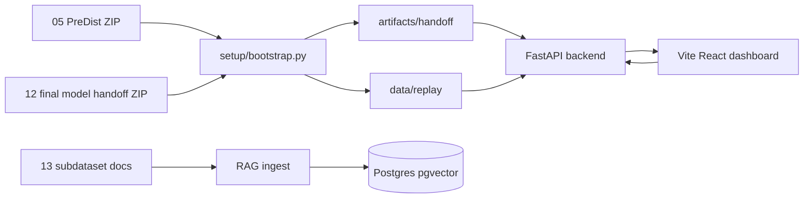
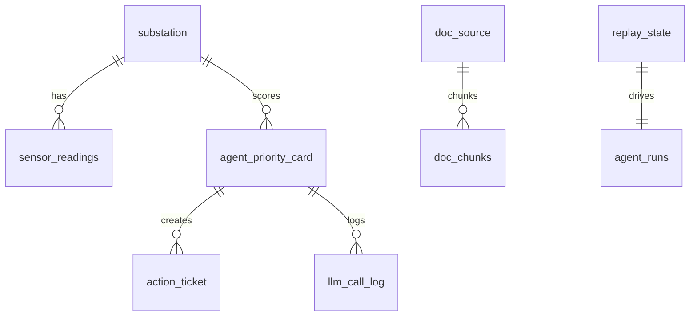
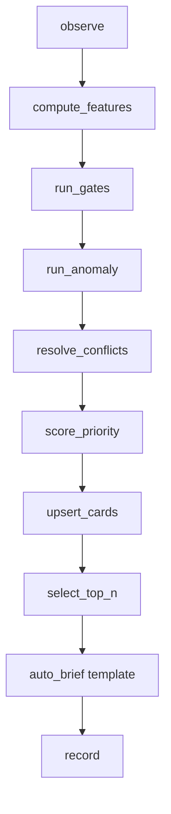
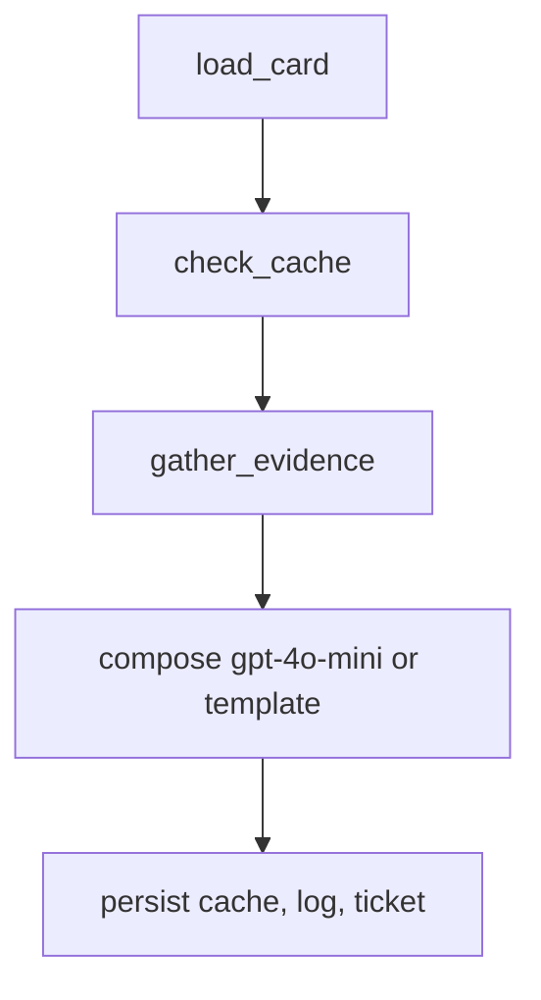

# HeatGrid 신운영서비스 재구축 보고서

## 기술스택

- Backend: FastAPI, asyncpg, Pydantic Settings, LangGraph-compatible graph wrappers
- ML runtime: scikit-learn 1.9.0, pandas 3.0.3, numpy 2.5.x, joblib 1.5.x
- DB: PostgreSQL 16 + pgvector, TimescaleDB 미사용
- RAG: BeautifulSoup, pypdf, sentence-transformers optional extra
- Frontend: Vite, React, TypeScript, CSS 기반 운영 차트, lucide-react

## 아키텍처



## DB ERD



## Agent 그래프



## 버튼 그래프



## 비용 설계

- `OPENAI_API_KEY`가 비어 있으면 `fallback:template`로 응답한다.
- 의도별 max token: 설명 300, 공지 400, 업체 전달문 500, 보고서 1200.
- `llm_call_log`에 토큰 추정치, 캐시 적중 여부, 생성 방식을 기록한다.
- `llm_response_cache`는 `intent + card_id + card_hash` SHA-256 키로 TTL 캐시를 제공한다.

## 실행 방법

```bash
cd 11_신운영서비스
docker compose up -d db
```

```bash
cd 11_신운영서비스/backend
uv sync
uv run python ../setup/bootstrap.py
uv run pytest ../tests -q
uv run uvicorn heatgrid_ops.api.app:app --host 0.0.0.0 --port 8000
```

```bash
cd 11_신운영서비스/frontend
npm install
npm run build
npm run dev
```

## 검증 결과

- 부트스트랩: handoff ZIP 57개 항목 추출, replay/derived 산출물 생성 완료
- 백엔드: `uv run pytest ../tests -q` 21개 통과, FastAPI TestClient의 httpx2 전환 경고 1건
- 파이썬 정적 실행성: `compileall` 통과
- RAG: `uv run python -m heatgrid_ops.rag.ingest --dry-run` 266개 chunk 확인
- 프론트: `npm run build` 통과, `npm audit --audit-level=moderate` 취약점 0건
- 화면 QA: 1440px 데스크톱/390px 모바일 viewport에서 빈 화면, 수평 overflow, 주요 텍스트 겹침 없음
- DB: `docker compose up -d db` 후 public base table 15개와 `vector` extension 확인

남은 제한은 일부 원본 PDF 텍스트 추출 결과가 문서 인코딩 문제로 깨질 수 있다는 점이다. OCR 또는 원본 PDF 텍스트 레이어 보정 전까지 RAG 품질은 HTML 문서와 정상 추출 PDF에 더 의존한다.
