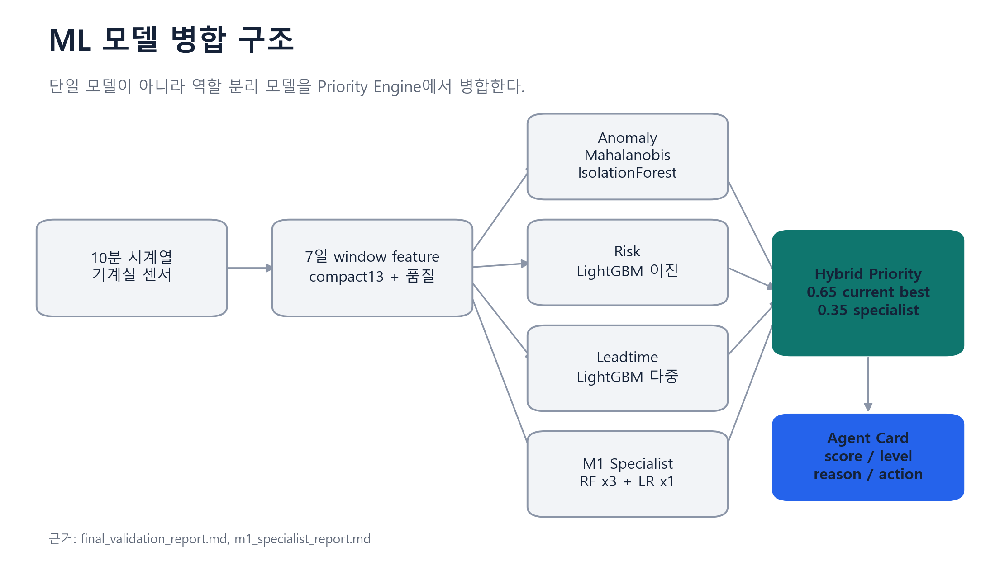
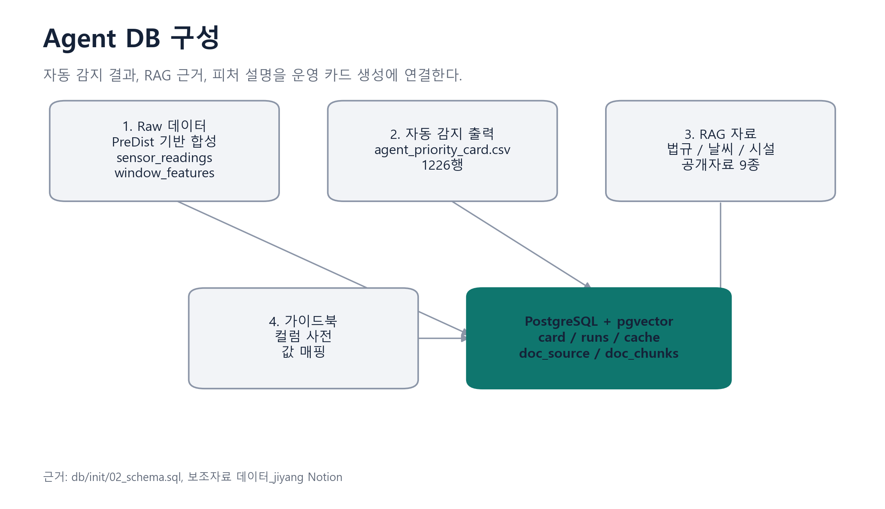
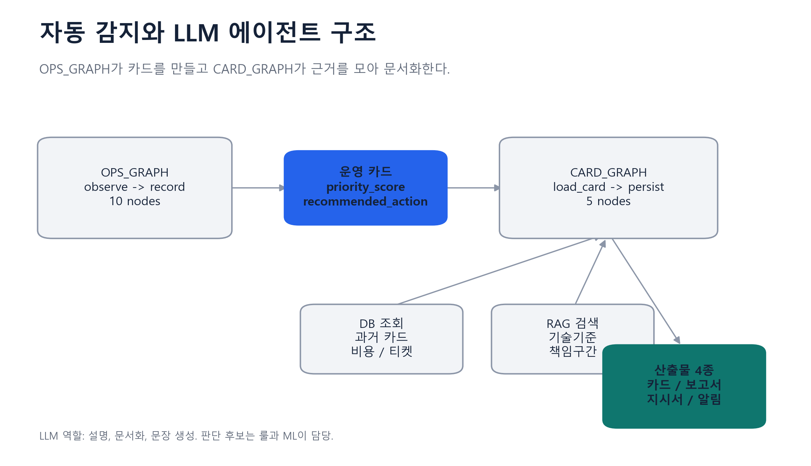
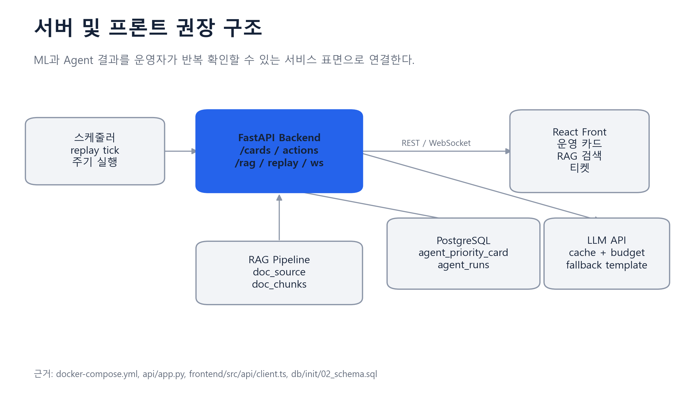

# 회의자료: ML 모델 + Agent 구조 + 서버/프론트

자료 기준: 2026-07-03 로컬 저장소 `C:\3rd_Project\HeatGridAgent` 확인 결과와 Notion 3개 페이지 내용을 합쳐 작성했다. 구현 근거는 최신 서비스 폴더인 `11_신운영서비스`와 `m1_specialist_handoff` 산출물을 기준으로 한다.

## 1. ML 모델

### 요약

HeatGrid의 ML 구조는 단일 모델 하나로 고장 여부를 판단하는 방식이 아니다. 이상 감지, 고장 위험, 발생 시점, 특화 게이트를 역할별로 분리한 뒤 Priority Engine에서 하나의 운영 우선순위 점수로 병합한다.

최종 병합 공식은 다음과 같다.

```text
priority_score = 0.65 * current_best + 0.35 * m1_specialist
```

이 점수는 운영 카드의 `priority_score`, `priority_level`, `review_required`, `recommended_action`으로 전달되고, LLM Agent는 이 값을 다시 판단하지 않고 설명과 문서화를 맡는다.

### 문제 정의 및 모델 선정 기준

목표는 기계실 10분 단위 시계열을 7일 window feature로 요약해, 운영자가 먼저 봐야 할 설비와 조치 방향을 안정적으로 고르는 것이다. 모델 선정 기준은 다음 4가지다.

| 기준 | 의미 |
|---|---|
| Window feature 적합성 | 10분 원천값보다 7일 변화, 품질, 지속성을 반영한 feature가 운영 판단에 더 적합하다. |
| False alarm 억제 | 운영 현장에서는 알림 수가 많아지는 것보다 신뢰 가능한 경보를 적게 내는 것이 중요하다. |
| Leadtime 표현 | 단순 고장 여부가 아니라 0-24h, 1-3d, 3-7d 같은 대응 시간대를 함께 제공해야 한다. |
| Agent 설명 가능성 | 카드, 보고서, 지시서로 전환할 수 있는 근거 필드와 규칙이 필요하다. |

AutoEncoder는 검토했지만 최종 구조에서는 제외했다. 재구성 오차만으로 운영자가 납득할 수 있는 원인 설명과 조치 문구를 만들기 어렵고, false alarm 제어와 leadtime 표현에서도 현재 목적에 비해 비용이 크기 때문이다.

### 입력과 출력

| 구분 | 내용 |
|---|---|
| 입력 | 기계실 10분 시계열 센서, 7일 window feature, compact13 feature, 품질 및 누락 정보 |
| 중간 출력 | anomaly score, risk class, leadtime bucket, specialist gate score |
| 최종 출력 | `priority_score` 0-100, `priority_level`, `risk/anomaly/leadtime bucket`, `review_required`, `recommended_action` |
| Agent 전달 | `agent_priority_card.csv` 1226행, 컬럼 사전, feature contract |



### 선택된 모델과 확인 수치

| 역할 | 모델 | 운영 의미 | 확인 수치 및 근거 |
|---|---|---|---|
| 이상 감지 | Mahalanobis(LedoitWolf) + IsolationForest | 정상 패턴에서 벗어난 설비를 보수적으로 탐지 | 활성 정책: IF ratio >= 0.90 and Mahalanobis ratio >= 1.00 with criticality persistence |
| 위험 판단 | LightGBM risk binary | 현재 또는 가까운 시점의 고장 위험 후보 산출 | risk_high_or_critical precision 0.9483, recall 0.7458, FPR 0.0129 |
| 발생 시점 | LightGBM leadtime multiclass | 0-24h, 1-3d, 3-7d 대응 시간대 구분 | Notion 모델 선정안 기준, Agent 카드의 대응 문구에 사용 |
| Fault Gate | RandomForest depth3 | 고장 게이트 | balanced accuracy 0.8455, precision 0.8750, recall 0.8909, normal FPR 0.2000 |
| Task Gate | RandomForest depth3 | 작업 이벤트 게이트 | balanced accuracy 1.0000, recall 1.0000, FPR 0.0000, window-policy 착시 가능성 표시 필요 |
| Activity Gate | RandomForest depth3 | 활동 이벤트 게이트 | balanced accuracy 1.0000, recall 1.0000, FPR 0.0000, window-policy 착시 가능성 표시 필요 |
| Pre-event | LogisticRegression | 고장 전조 보조 신호 | balanced accuracy 0.8500, recall 0.7857, FPR 0.0857 |
| Hybrid Priority | current_best 65% + M1 specialist 35% | 운영 우선순위 최종 점수 | holdout precision 0.8966, recall 0.6753, FPR 0.0566, event recall 0.875 |

### 최종 선택 이유

이 구조를 선택한 이유는 세 가지다.

1. ML 판단을 역할별로 나누어 이상, 위험, 발생 시점, 이벤트 게이트를 각각 해석할 수 있다.
2. Priority Engine이 최종 점수를 단일화하므로 운영 화면과 보고서는 하나의 정렬 기준을 쓸 수 있다.
3. LLM은 모델 판단을 새로 만들지 않고, 이미 계산된 근거를 카드와 문서로 압축하므로 토큰 비용과 환각 위험을 줄일 수 있다.

## 2. Agent

### 전체 구성

Agent는 두 층으로 나눈다.

| 층 | 역할 | 출력 |
|---|---|---|
| 자동 감지 에이전트 | feature 계산, gate 실행, anomaly 실행, conflict resolve, priority score 계산 | `agent_priority_card.csv` |
| 운영 보조 LLM 에이전트 | 카드 로드, 캐시 확인, DB 조회, RAG 검색, 근거 수집, 문서 작성 | 운영 카드, 보고서, 지시서, 관리소 알림 |

즉, 앞단 Agent의 출력이 뒤단 LLM Agent의 입력이다. LLM은 고장 여부를 독립적으로 판단하지 않고, 카드에 들어 있는 score, level, reason, action을 운영자가 읽을 수 있는 문장으로 바꾼다.

### DB 구성



DB와 보조 자료는 4개 묶음으로 정리한다.

| 묶음 | 내용 | 쓰임 |
|---|---|---|
| Raw 데이터 | PreDist 기반 합성 데이터, `sensor_readings`, `window_features` | ML feature와 replay tick의 입력 |
| 자동 감지 출력 | `agent_priority_card.csv` 1226행 | 운영 카드와 LLM 문서화의 기준 데이터 |
| RAG 자료 | 법규, 날씨, 시설, 공개 API 및 문서 | 카드 근거 보강, 책임구간 및 기술기준 설명 |
| 가이드북 | `agent_card_column_dictionary_ko.csv`, feature 설명, 값 매핑 | 운영자용 문장과 화면 라벨 생성 |

RAG 1차 MVP 자료는 다음 9종이다.

| 번호 | 자료 | 선정 이유 |
|---|---|---|
| 1 | 열사용시설 기준 정보 | 열사용시설과 열공급 설비 구분의 기본 기준 |
| 2 | 사용자 관리범위 및 책임구간 | 고장 책임과 조치 주체 판단 |
| 3 | 공동주택 단지 목록 | 대상 단지 식별과 주소 기반 연결 |
| 4 | 공동주택 기본 정보 | 세대수, 준공연도, 단지 규모 등 운영 맥락 |
| 5 | 공동주택 유지관리 이력 | 반복 민원과 보수 이력 근거 |
| 6 | ASOS 날씨 | 외기 영향과 계절성 설명 |
| 7 | 특일 정보 | 휴일, 특수일 수요 변동 설명 |
| 8 | 집단에너지시설 기술기준 | 기술 기준 근거 문장 |
| 9 | 열공급시설 검사기준 | 점검 항목과 정비 권고 근거 |

### Agent 구조



확인된 구현 기준으로 `OPS_GRAPH`는 10개 노드, `CARD_GRAPH`는 5개 노드다.

| Graph | 노드 흐름 | 의미 |
|---|---|---|
| OPS_GRAPH | observe -> compute_features -> run_gates -> run_anomaly -> resolve_conflicts -> score_priority -> upsert_cards -> select_top_n -> auto_brief -> record | 주기 실행에서 운영 카드까지 만드는 자동 감지 흐름 |
| CARD_GRAPH | load_card -> check_cache -> gather_evidence -> compose -> persist | 카드 하나를 읽고 근거를 모아 LLM 응답과 문서로 저장하는 흐름 |

### 산출물 4종

| 산출물 | 대상 | 핵심 내용 |
|---|---|---|
| 우선순위 알림 카드 | 운영자 | score, level, why, recommended action |
| 한난 내부 보고서 | 내부 운영 및 회의 | 고장 보고, 월간 요약, 연간 요약 |
| 정비업체 지시서 | 현장 정비업체 | 조치 항목, 확인 순서, 주의 기준 |
| 아파트 및 건물 관리소 알림 | 관리소 | 영향 가능성, 점검 예정, 안내 문구 |

### Why Agent?

Agent의 핵심 가치는 판단 압축이다. 모든 센서, feature, 모델 점수, 법규 문서를 운영자가 직접 읽는 대신, Agent가 우선순위 카드와 근거 문장으로 압축한다. 분석은 코드와 ML이 담당하고, 판단 후보는 룰과 ML이 만들며, LLM은 설명, 문서화, 문장 생성을 맡는다. 이 분담이 있어야 토큰 비용을 줄이면서도 운영자가 검토 가능한 형태를 유지할 수 있다.

## 3. 서버 및 프론트

### 권장 구조



서버와 프론트는 ML과 Agent 결과를 운영자가 반복 확인하는 표면이다. 현재 구현 기준으로는 FastAPI 백엔드, PostgreSQL + pgvector, React 프론트, LLM API 캐시 및 예산 제어 흐름이 가장 자연스럽다.

| 구성 | 권장 역할 |
|---|---|
| Scheduler | replay tick 또는 주기 실행으로 OPS_GRAPH 실행 |
| FastAPI Backend | `/cards`, `/actions`, `/rag`, `/replay`, `/ws` 제공 |
| PostgreSQL + pgvector | `agent_priority_card`, `agent_runs`, `llm_response_cache`, `doc_source`, `doc_chunks` 저장 |
| LLM API 경유층 | 캐시, 일일 예산, fallback template 적용 |
| React Front | 운영 카드 대시보드, RAG 검색, 티켓, 실시간 WebSocket 업데이트 |

### 권고

ML과 Agent가 현재 구조라면 서버와 프론트는 모델 실험 화면이 아니라 운영 카드 검토 화면으로 가는 것이 좋다. 첫 화면은 `priority_score` 기준 상위 카드, 위험 레벨, 근거, 권장 조치, RAG 근거, 티켓 상태를 한 번에 볼 수 있어야 한다. LLM 호출은 사용자가 문서화나 상세 설명을 요청할 때만 실행하고, 동일 카드와 동일 intent는 캐시를 우선 사용한다.

## 회의에서 결정할 항목

| 결정 항목 | 제안 |
|---|---|
| ML 기준 | Hybrid Priority를 공식 운영 점수로 사용 |
| Agent 범위 | LLM은 판단 생성이 아니라 설명과 문서화 담당 |
| RAG 1차 범위 | Notion 보조자료 9종을 MVP 기준으로 사용 |
| 서버 우선순위 | 카드 대시보드, WebSocket 업데이트, LLM 캐시, RAG 검색 순서 |
| 남은 보완 | `substation_id`와 실제 단지, 주소, 책임구간 매핑 정교화 |

## 검증 근거

| 항목 | 확인 내용 |
|---|---|
| Agent 카드 행 수 | `agent_priority_card.csv` 1226행 |
| 행 정합성 | canonical window 1252행 중 active card 1226행, pre_fault train/validation 26행 제외 |
| 공식 병합 | `0.65 * current_best + 0.35 * m1_specialist` |
| 최신 구현 경로 | `11_신운영서비스/backend/heatgrid_ops`, `11_신운영서비스/frontend`, `11_신운영서비스/db/init/02_schema.sql` |
| Notion 서사 | ML 모델 선정 및 병합, 보조자료 데이터_jiyang, Why Agent? 3개 페이지 |

