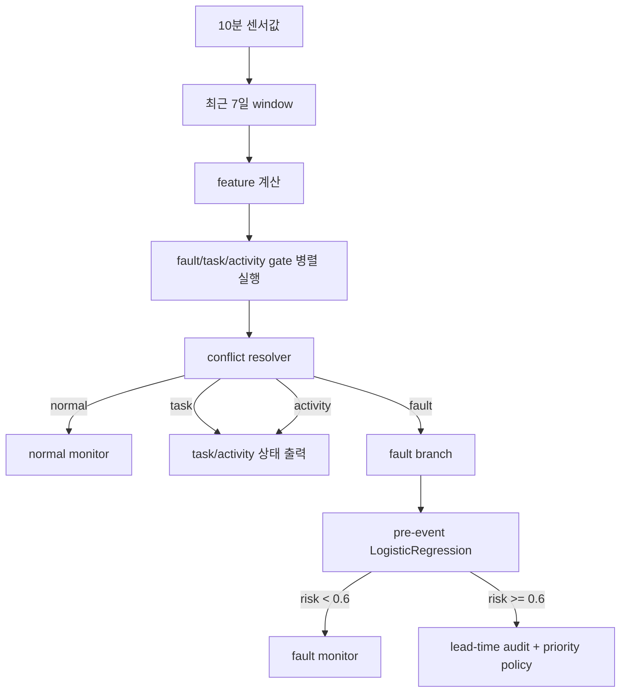

# HeatGridAgent

HeatGridAgent는 지역난방/열공급 설비의 10분 단위 SCADA 시계열과 이벤트 메타데이터를 사용해, 정상 상태와 고장/작업/활동 이벤트를 구분하고 고장 조기탐지 및 출동 우선순위 산정 가능성을 검증하는 실험 저장소다.

현재 저장소의 중심은 PreDist 데이터셋 기반의 M1/M2 제조사 실험이다. 지금까지의 결론은 단일 4분류 모델을 바로 쓰기보다, class별 binary gate와 rule layer를 조합하는 방식이 더 안전하다는 것이다.

## 현재 결론

- M1 기준 runtime 후보는 `fault`, `task`, `activity` gate를 병렬로 돌린 뒤 conflict resolver로 최종 상태를 정하는 구조다.
- 앞단 gate는 `RandomForest depth=3` 계열을 사용한다.
- fault 내부 조기탐지, 즉 `normal vs pre_event`, 는 `compact13_overlap + LogisticRegression + threshold 0.6` 흐름으로 정리했다.
- lead-time은 별도 회귀 모델이 아니라, threshold 0.6을 안정적으로 넘기 시작하는 시점인 `stable crossing` audit으로 해석한다.
- priority score는 ML 모델이 아니라 정책 점수다. 현재 후보 공식은 `100 * (0.55*risk_probability + 0.30*leadtime_urgency + 0.15*group_weight)`다.
- M2 외부 검증에서 앞단 `fault_gate`는 통과했지만, `normal vs efd_possible/pre_event` 외부 성능은 아직 약하다. 그래서 다음 핵심 과제는 M1 전용 최적화가 아니라 M1+M2 표준화 가능한 pre-event 모델 재설계다.

## 주요 성능 스냅샷

### M1 runtime gate 후보

| component | feature/model | threshold | balanced accuracy | recall | normal FPR | 판단 |
|---|---:|---:|---:|---:|---:|---|
| fault gate | compact13 + RandomForest depth3 | 0.5 | 0.8455 | 0.8909 | 0.2000 | runtime v1 후보 |
| task gate | compact13 + RandomForest depth3 | 0.5 | 1.0000 | 1.0000 | 0.0000 | 상태 감지 후보 |
| activity gate | compact13 + RandomForest depth3 | 0.5 | 1.0000 | 1.0000 | 0.0000 | 활동 감지 후보 |
| fault pre-event gate | compact13_overlap + LogisticRegression | 0.6 | 0.8500 | 0.7857 | 0.0857 | M1 조기탐지 후보 |

task/activity는 수치가 너무 좋아 window-policy 착시 가능성이 남아 있다. 최종 운영 확정값이 아니라 검증 후보로 본다.

### M2 외부 성능 검증

| dataset | gate | balanced accuracy | precision | recall | f1 | normal FPR | 판단 |
|---|---:|---:|---:|---:|---:|---:|---|
| M2 fault_no_overlap | fault gate | 0.8667 | 0.9474 | 0.8000 | 0.8675 | 0.0667 | 통과 |
| M2 task_post_1d | task gate | 1.0000 | 1.0000 | 1.0000 | 1.0000 | 0.0000 | 통과, 의미 검토 필요 |
| M2 activity_pre_1d | activity gate | 1.0000 | 1.0000 | 1.0000 | 1.0000 | 0.0000 | 통과, 의미 검토 필요 |
| M2 normal vs efd_possible | pre-event gate | 0.5200 | 0.4706 | 0.6400 | 0.5424 | 0.6000 | 실패 |

## 데이터 구조

원본 데이터는 `05_데이터셋/PreDist/predist_dataset.zip`에 보관한다. 메타데이터는 바로 확인할 수 있도록 `05_데이터셋/PreDist/metadata`에 분리되어 있다.

| 구분 | M1 | M2 |
|---|---:|---:|
| normal events | 35 | 30 |
| faults.csv records | 33 | 40 |
| efd_possible=True | 29 | 26 |
| disturbances | 165 | 163 |
| disturbance types | fault/task/activity | fault/task/activity |

모델 입력은 원본 10분 시계열을 그대로 넣지 않는다. 이벤트 1건은 보통 7일 window이고, 최대 `1008행 x 센서 컬럼`을 요약해 feature 1행으로 만든다.

초기 baseline은 M1 전체 기계실에 공통으로 존재하는 10개 센서만 사용했다. 이 공통 센서 기준은 설비 구성 차이를 줄이는 장점이 있지만, DHW/급탕 전용 신호를 충분히 반영하지 못한다는 한계가 있다.

## 모델 흐름



## 폴더 구성

| 경로 | 내용 |
|---|---|
| `01_프로젝트개요` | 프로젝트 개요와 초기 문서 |
| `02_아키텍처` | AIoT Agent와 runtime 구조 메모 |
| `03_전략_기획` | 제품/전략/기획 문서 |
| `04_리서치` | 데이터셋과 출시 타당성 리서치 |
| `05_데이터셋` | PreDist 원본 zip과 metadata |
| `06_노트북` | 실험 노트북 |
| `07_데이터산출물` | 보고서, audit CSV, feature CSV, 시각화 |
| `08_모델산출물` | joblib 모델과 handoff 패키지 |
| `scripts` | 주요 노트북 산출물 생성용 Python script |
| `99_참고자료` | 이전 참고 자료 |

## 핵심 산출물

- `07_데이터산출물/26_M1_easy_interpretation_A_to_Z_보고서.md`: 전체 용어와 흐름을 쉽게 설명한 문서
- `07_데이터산출물/32_M1_label_taxonomy_model_rule_diagram.md`: label taxonomy와 모델 위치 다이어그램
- `07_데이터산출물/33_M1_full_gate_lock_and_runtime_policy_보고서.md`: full gate runtime rule 후보
- `07_데이터산출물/35_M1_joblib_external_M2_performance_validation_보고서.md`: M2 외부 성능 검증
- `08_모델산출물/m1_fault_gate_rf_depth3.joblib`: M1 fault gate 후보
- `08_모델산출물/m1_task_gate_rf_depth3.joblib`: M1 task gate 후보
- `08_모델산출물/m1_activity_gate_rf_depth3.joblib`: M1 activity gate 후보
- `08_모델산출물/m1_fault_pre_event_logistic.joblib`: M1 fault 내부 pre-event 후보
- `08_모델산출물/model_handoff_m1_front_gate_2026-07-01.zip`: front gate handoff 패키지

## 실행 환경

이 저장소는 Python 3.12 기준으로 관리한다.

```powershell
uv sync
.venv\Scripts\python.exe -m ipykernel install --user --name heatgridagent
```

주요 의존성은 `pyproject.toml`에 있다.

- pandas
- scikit-learn
- matplotlib
- lightgbm
- xgboost
- nbformat / nbclient

## 현재 한계

- M1 전용으로 좋은 결과가 나온 기준이 M2 pre-event에서는 그대로 일반화되지 않았다.
- M2는 같은 PreDist 계열의 다른 manufacturer이므로 완전히 독립된 외부 기관 검증은 아니다.
- task/activity gate는 수치가 지나치게 좋아 window 정의나 label 구조가 쉬운 문제를 만들었을 가능성이 있다.
- 공통 10개 센서 기준은 범용성이 좋지만, 급탕/DHW 전용 고장을 설명하는 데 한계가 있다.
- priority score는 정책 layer이며, 현장 비용/SLA 기준으로 아직 확정된 운영 점수는 아니다.

## 다음 작업

1. M1+M2를 함께 쓰는 standardizable pre-event model line을 별도 실험 라인으로 만든다.
2. 공통 센서 schema와 system capability tag를 표준화한다.
3. M1 CV, M2 CV, M1->M2, M2->M1, pooled group CV를 분리해 검증한다.
4. LogisticRegression으로 고정하지 않고, tree/boosting 후보를 cross-manufacturer 기준으로 비교한다.
5. DHW 센서가 있는 subset에서는 DHW 보조 feature/model 가능성을 별도로 검토한다.

## 해석 기준

이 저장소의 결과는 아직 운영 확정 모델이 아니다. 현재 상태는 다음 단계로 가기 위한 검증 후보 묶음이다.

- M1 내부 runtime 후보: 있음
- M2 앞단 gate 외부 검증: 일부 통과
- M2 pre-event 외부 검증: 실패
- 표준화 가능한 pre-event 모델: 다음 작업에서 재설계 필요
